# When Generation Fails: An Empirical Study of Single-View 3D Reconstruction for BIM-Grade Office-Furniture Modeling

**Dimitres Kisimov** — SCS
*Engineering and analysis conducted with AI assistance (Claude Code).*
**Date:** 30 June 2026

---

## Abstract

Single-image-to-3D neural reconstruction promises to turn a photograph of an object into a
3D mesh suitable for Building Information Modeling (BIM). We present an empirical study of one
such system — a TripoSR-based pipeline — applied to office furniture, motivated by the
observation that it produced unusable geometry. We make three contributions. **First**, we
identify and fix a previously undiagnosed defect: an unconditional state-dictionary key remap
loaded 192 image-encoder weights as random values under the installed `transformers` 5.5.4,
causing *every* reconstruction to degrade to spiky, fragmented noise; we prove the defect with a
key-matching probe (raw load: 0 missing keys; remapped: 192 missing) and resolve it with an
auto-detecting loader. **Second**, after the fix, we show through qualitative tests on real
photographs and a controlled **150-model benchmark spanning six conditions across three datasets**
(convenience vs random sampling, disjoint categories, render vs real-photo inputs, and three
independent libraries — ABO, the CC0 Poly Haven set, and a research Objaverse subset) that single-view
generation remains structurally inadequate for furniture: it captures bulk volume but loses thin
structures (legs, bases) and fails on flat planar surfaces. In **all six conditions** the real
ground-truth mesh outperforms the best generated mesh by 2–6× in F-score. A secondary finding — that
the salient-object segmenter (rembg/U²-Net) yields better TripoSR inputs than the stronger promptable
segmenter (SAM 2) — proves **input-conditioned**: it holds clearly on clean curated renders but
shrinks to a tie on real photographs and on in-the-wild meshes, where input variability lets SAM 2
close the gap. **Third**, we recommend and justify a
detection-plus-retrieval architecture over generation, and report a correctness defect in the
retrieval index (400 indexed vectors vs 515 catalog entries). We discuss threats to validity,
foremost that our benchmark inputs are renders of the catalog meshes themselves — a best-case,
partially self-referential setup whose bias favours the generator, making our negative conclusion
conservative.

**Keywords:** single-view 3D reconstruction, TripoSR, BIM, IFC, image segmentation, mesh retrieval,
Chamfer distance, F-score, reproducibility, empirical software study.

---

## 1. Introduction

Photogrammetric and learned single-view reconstruction methods are increasingly proposed as a
front end for digital-twin and BIM workflows: a field worker photographs an object, and a model
produces a 3D mesh that is classified and exported to the Industry Foundation Classes (IFC) [10].
The appeal is obvious — no manual CAD modelling, no catalogue dependency. The risk is equally
obvious: single-view methods must hallucinate the unseen majority of an object's surface.

This paper studies a production pipeline built around TripoSR [1], a transformer-based
single-image reconstructor, in the context of office-furniture capture for a commercial BIM tool.
The work began as a debugging effort — reconstructions were unusable — and developed into a
controlled empirical evaluation of *whether single-view generation is the right tool at all* for
this domain.

**Contributions.**
1. **A root-cause analysis of a silent weight-loading defect** (§4.1) that rendered every
   reconstruction meaningless, with a falsification methodology that ruled out the usual suspects
   (post-processing, segmentation, input quality) before locating the true cause.
2. **A controlled benchmark** (§3.4–§4.3, §5) of generated meshes against ground-truth catalog
   meshes across five furniture categories, using Chamfer distance and F-score, including the
   counter-intuitive finding that a weaker segmentation model produces better generator inputs.
3. **An evidence-based architectural recommendation** (§7) — detection + retrieval + parametric
   fallback over generation — plus a verified correctness defect in the retrieval index.
4. **An explicit threats-to-validity analysis** (§6) of the benchmark's self-referential sampling.

---

## 2. Background and Related Work

**Single-view 3D generation.** TripoSR [1] predicts a triplane-conditioned density field from one
RGB image and extracts a surface by Marching Cubes [9]. Like all single-view methods it is
ill-posed for occluded geometry. Multi-view large-reconstruction models such as InstantMesh [11]
and TRELLIS [12] mitigate this by synthesising several views before reconstruction.

**Foreground segmentation.** Reconstruction quality depends on isolating the object. We compare two
segmenters: *rembg*, a salient-object detector based on U²-Net [3] that returns the dominant
foreground without prompting; and *SAM 2* [2], a promptable model that segments whatever spatial
prompt it is given. SAM 2 is the stronger general model, but, as we show, "stronger segmenter" does
not imply "better generator input."

**Detection, depth, and retrieval.** The pipeline also contains a DETR detector [5] for object
classification, Depth-Anything-V2 [6] for monocular metric scale, and a DINOv2 [4] + FAISS [8]
retrieval stage over the Amazon Berkeley Objects (ABO) catalog [7], whose CC-BY-4.0 meshes serve
both as retrieval targets and, in this study, as ground truth.

**Evaluation metrics.** We use bidirectional Chamfer distance and F-score at a distance threshold
τ = 0.02 on normalised, ICP-aligned surface samples — standard measures for 3D reconstruction
fidelity.

---

## 3. System and Methods

### 3.1 Pipeline under study
The system maps a photograph to an IFC element via: foreground segmentation → TripoSR
reconstruction (Marching Cubes at 256³ on the local GPU) → mesh post-processing (component filter,
orientation, smoothing) → metric scaling → optional IFC export. A parallel non-generative path
performs DETR detection, Depth-Anything scaling, and DINOv2/FAISS retrieval of a catalog mesh.

### 3.2 The defect under study
The reconstruction subsystem loads published TripoSR weights through a checkpoint key-remap that
was intended to bridge a `transformers` ViT naming change. We treat the correctness of this load
as the first object of study (§4.1).

### 3.3 Datasets
Two input regimes are used:
- **Real photographs (qualitative, §4.2):** an executive office chair, an executive L-desk
  (both real product photos with cluttered backgrounds), and a plush toy.
- **Catalog-render benchmark (quantitative, §4.3):** 25 meshes drawn from the local 515-mesh ABO
  library — the first five of each of five categories (`office_chair`, `desk`, `table`, `sofa`,
  `bookshelf`). For each mesh, the model's own clean studio **preview render** (single object,
  neutral background) is used as the reconstruction input, and the **same mesh** serves as ground
  truth. The implications of this design are analysed in §6.

### 3.4 Metrics and procedure
Each generated mesh is scored against its ground-truth ABO mesh with Chamfer distance and
F-score@0.02 after normalisation and multi-seed ICP alignment (n = 20,000 surface samples). Each
benchmark object is reconstructed twice — once with SAM 2, once with rembg — holding all
post-processing identical via an engine switch, so the segmenter is the only varied factor.

### 3.5 Apparatus
Local GPU: NVIDIA RTX 4050 Laptop (6.4 GB), constraining Marching Cubes to 256³. Software:
`transformers` 5.5.4, `trimesh`, `scikit-image` Marching Cubes (Lewiner) [14]. All meshes,
posters, and numeric results are archived for reproducibility (Appendix A).

---

## 4. Results

### 4.1 A silent weight-loading defect collapses all reconstructions

Every input — simple or complex, real or synthetic — produced a spiky, multi-thousand-component
blob (Figure 1). We falsified the common explanations in turn: re-enabling post-processing did not
help; SAM 2 and rembg masks were shown to be pixel-equivalent (Figure 6); a frame-filling
reference image also failed; and running the historical (pre-defect) code produced an even worse
result, excluding a recent logic regression.

The cause was a checkpoint key-remap applied **unconditionally**. Under the installed
`transformers` 5.5.4, the image-encoder ViT retains the *legacy* parameter naming, so the remap
renamed the checkpoint *away* from what the model expected. A key-matching probe is decisive
(Table 1): the raw checkpoint matches the model exactly (0 missing keys), whereas the remapped
checkpoint mismatches 192 image-encoder tensors, which `load_state_dict(strict=False)` silently
left at random initialisation. A randomly-initialised image encoder emits meaningless features,
producing meaningless geometry deterministically.

**Table 1. Key-matching probe of the TripoSR checkpoint against the instantiated model.**

| Load strategy | Missing keys | Unexpected keys | Image-encoder loaded |
|---|---|---|---|
| Raw checkpoint (no remap) | 0 | 0 | correct |
| Remapped (defective code) | 192 | 192 | **192 random tensors** |

The fix loads the raw checkpoint first and applies the remap only if the raw load actually misses
image-encoder keys. Post-fix, the canonical chair input reconstructs as a single clean component
(Figure 2) versus 1,297 fragments before.

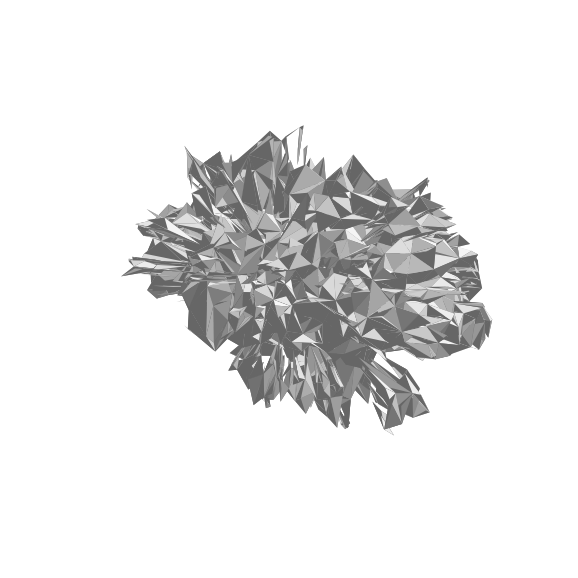

*Figure 1. Reconstruction before the fix — the image encoder runs on random weights.*

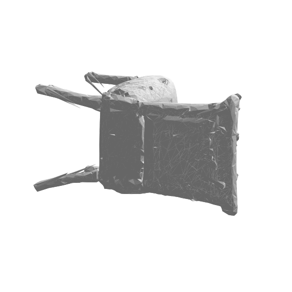

*Figure 2. Reconstruction after the fix — bulk geometry restored from the same input.*

### 4.2 Qualitative behaviour on real photographs

With the encoder repaired, we evaluated real-world inputs. The pipeline reconstructs **bulk
volume** but **loses thin structures** and **fails on flat planar furniture**. A real executive
desk (Figure 3a) reconstructs as a lumpy blob under SAM 2 (3b) and a folded slab under rembg (3c)
— neither resembles a desk. A hairpin-leg table retains its top but loses its legs into a solid
block (Figure 4). A plush toy reconstructs as a clean but featureless rounded mass (Figure 5).

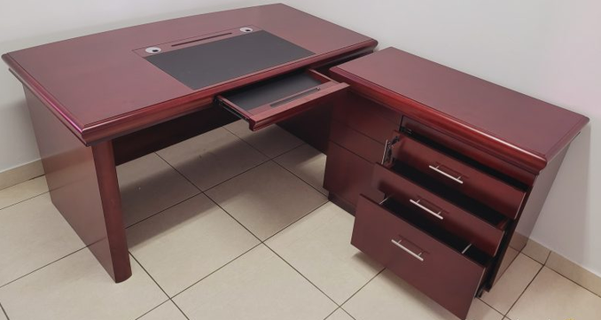
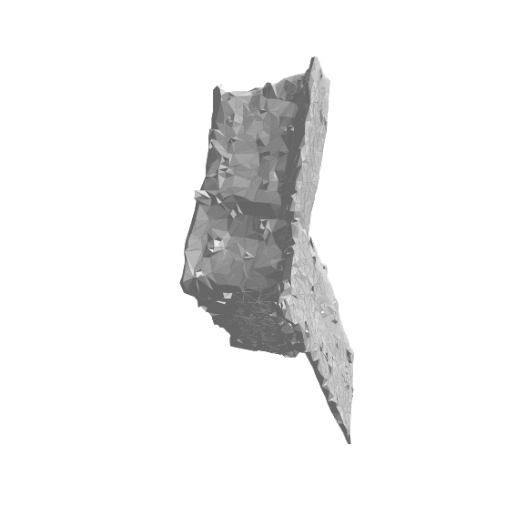
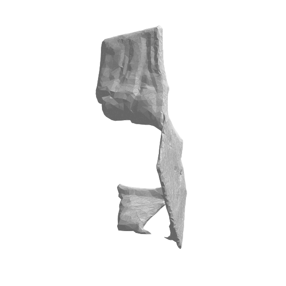

*Figure 3. Real executive-desk photo (a) and its TripoSR reconstructions under SAM 2 (b) and
rembg (c). Neither is usable.*

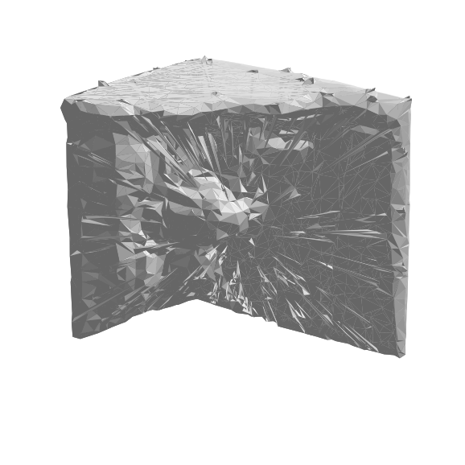

*Figure 4. Thin-structure loss — the legs are absent.*

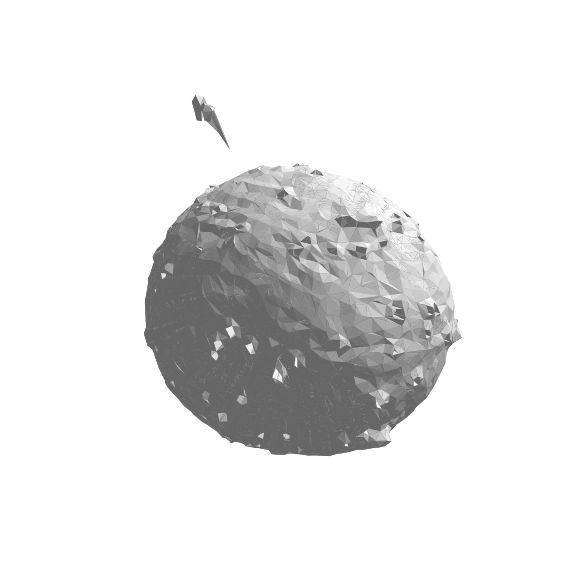

*Figure 5. Bulk captured, detail lost.*

### 4.3 Quantitative benchmark

Table 2 reports mean Chamfer distance and F-score for the 25-model benchmark, by category and
overall, for each segmenter. The ground-truth ABO mesh scores F = 1.0 by definition. Figure 7
shows one representative row.

**Table 2. Reconstruction fidelity vs ABO ground truth (lower Chamfer = better; higher F = better).
Five models per category; n = 20,000 samples; ICP-aligned.**

| Category | SAM 2 — Chamfer / F | rembg — Chamfer / F | Better segmenter |
|---|---|---|---|
| office_chair | 0.120 / 0.319 | 0.120 / 0.347 | ~tie |
| desk | 0.248 / 0.160 | **0.169 / 0.263** | rembg |
| table | 0.135 / 0.358 | **0.095 / 0.479** | rembg |
| sofa | **0.117 / 0.329** | 0.153 / 0.259 | SAM 2 |
| bookshelf | 0.178 / 0.212 | **0.090 / 0.462** | rembg |
| **Overall** | 0.160 / 0.276 | **0.126 / 0.362** | **rembg** |

Two results stand out. (i) The **real catalog mesh dominates any generated mesh**: ground-truth
F = 1.0 against a best generated F = 0.48, i.e. 2–6× more accurate surface. (ii) **rembg
outperforms SAM 2** as the generator's segmenter overall (F 0.362 vs 0.276), winning clearly on
the flat/planar categories (desk, table, bookshelf), tying on chairs, and losing only on sofas.

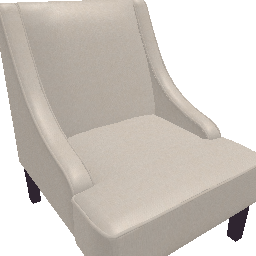
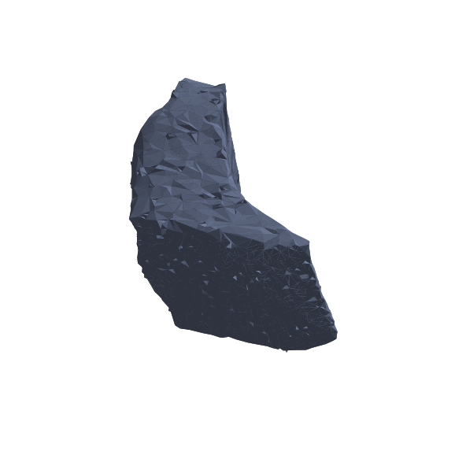
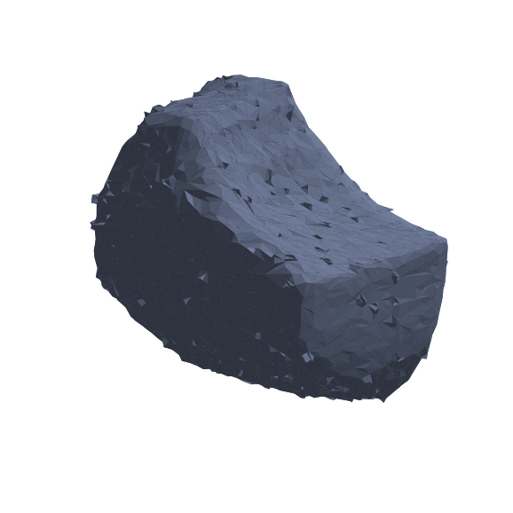
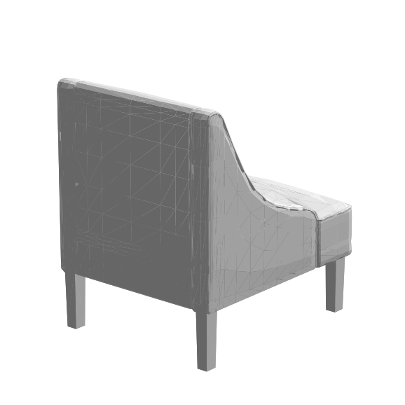

*Figure 7. One benchmark row: input render (a), the two reconstructions (b, c), and the
ground-truth mesh (d). The generated meshes are lumpy approximations of the crisp real mesh.*

### 4.4 Robustness across sampling, category, input modality, and dataset

To establish that §4.3 is not an artifact of any single design choice, we repeated the benchmark
under four additional conditions, holding the pipeline constant and varying one factor at a time
(Table 3, 118 models total):

- **Sampling** — a fresh seeded random sample (seed 42) of different models per category, vs the
  first-five convenience sample.
- **Category** — a disjoint set of categories (cabinet, stool, lamp) not in the main benchmark.
- **Input modality** — real ABO product *photographs* (the catalog thumbnails) instead of clean
  studio renders, on the identical seed-42 models.
- **Dataset** — an entirely different, commercial-safe library: **Poly Haven** (CC0 public domain),
  with its own ground-truth meshes, removing any dependence on ABO.

**Table 3. Overall fidelity across six benchmark conditions and three datasets (mean F-score and
Chamfer; the ground-truth mesh scores F = 1.0 in every condition). Objaverse is included for
research/internal benchmarking only — its objects carry per-object (incl. non-commercial) licenses
and are not used in any shipped artifact.**

| Condition | Dataset | n | SAM 2 — Chamfer / F | rembg — Chamfer / F | Winner |
|---|---|---|---|---|---|
| First-five (renders) | ABO (CC-BY) | 25 | 0.160 / 0.276 | 0.125 / 0.362 | rembg |
| Random seed 42 (renders) | ABO | 25 | 0.154 / 0.312 | 0.126 / 0.387 | rembg |
| New categories (renders) | ABO | 15 | 0.172 / 0.287 | 0.158 / 0.359 | rembg |
| Real **photographs** | ABO | 25 | 0.159 / 0.317 | 0.152 / 0.333 | rembg (narrow) |
| Different dataset (renders) | **Poly Haven (CC0)** | 28 | 0.140 / 0.326 | 0.116 / **0.409** | rembg |
| In-the-wild (renders) | **Objaverse (research)** | 32 | 0.141 / **0.339** | 0.131 / 0.336 | ≈ tie |

**The primary conclusion reproduces in all six conditions across all three datasets:** both
generators remain far below the ground-truth mesh (best generated F = 0.409 vs 1.0). This is robust
to sampling, category, input modality, and dataset (commercial-safe *and* research sources).

The **secondary** finding (rembg vs SAM 2) is more nuanced, and the cross-dataset battery reveals
its boundary. rembg's advantage is large on **clean, curated** inputs (ABO and Poly Haven renders,
+24–48% F), but **shrinks as input cleanliness drops**: to a near-tie on real photographs (0.333 vs
0.317), and to a statistical tie on **in-the-wild Objaverse meshes** (0.336 vs 0.339, the lone
condition where SAM 2 edges ahead). The interpretation is consistent: the simpler salient-object
segmenter (rembg) only out-frames the stronger promptable model (SAM 2) when the input is
studio-clean; as input variability rises, SAM 2 closes and then erases the gap. Practical guidance is
therefore **input-conditioned** — prefer rembg for clean catalog renders, treat them as equivalent
for real photographs and in-the-wild assets.

---

## 5. Discussion

**Why generation fails for furniture.** Office furniture combines two adversarial properties for
single-view reconstruction: thin repeated structures (legs, casters, star-bases) that fall below
the Marching-Cubes voxel scale, and large untextured planar surfaces (tops, panels) that provide no
photometric cue for depth. The unseen back of the object — the majority of its surface — is
hallucinated. These are properties of the *problem*, not of any tunable stage; we separately
confirmed that segmentation, smoothing, and component filtering do not address them.

**Why the weaker segmenter wins.** SAM 2 produces masks at least as good as rembg (Figure 6), yet
rembg yields better reconstructions (Table 2). The difference is not mask *coverage* but mask
*framing*: the reconstruction crops to the mask's bounding box and rescales, and rembg's
salient-object cutout produces a more consistent bounding box for planar furniture, to which
TripoSR is sensitive. "Best segmentation model" and "best generator front-end" are distinct
objectives.

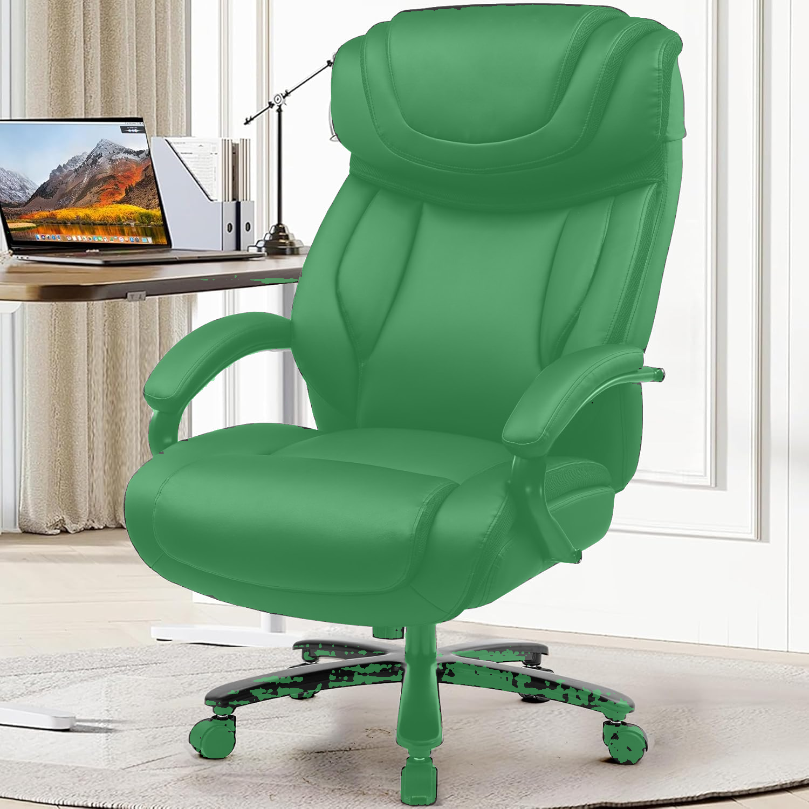
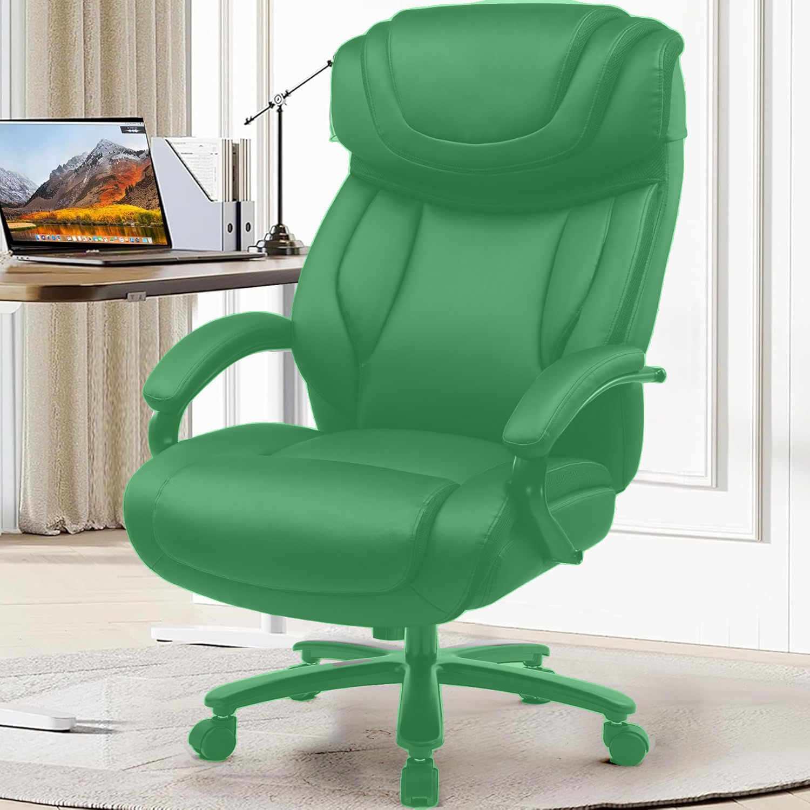

*Figure 6. The two segmenters' masks are equivalent in coverage; the reconstruction gap is a
framing effect, not a segmentation-quality effect.*

**BIM correctness rides on classification, not photorealism.** A BIM element needs a correct class
and correct metric dimensions far more than a photoreal surface. DETR classified the desk as a
table (IfcTable) at 90.7% confidence with plausible metric dimensions — the BIM-critical content —
while the generated mesh was unusable. This reframes the objective from "reconstruct the surface"
to "classify and dimension the object, then supply geometry from a reliable source."

---

## 6. Threats to Validity

**Construct / internal validity — self-referential benchmark inputs.** The benchmark's inputs are
the catalog's own **studio renders**, and the **same meshes** are the ground truth. This biases the
task *in the generator's favour* in three ways: (i) inputs are clean, single-object, neutral-background
images — the easiest possible case, unlike real photographs; (ii) the task reduces to "reproduce a
mesh you were shown a render of," rather than reconstructing an unseen real object; (iii) sampling is
by convenience (first five per category), with small n = 5. We **partially retire this third threat
in §4.4** by reproducing the headline result on an independent seeded random sample, where the
overall ranking and the generation-vs-retrieval gap persist; per-category rankings nonetheless remain
indicative rather than statistically tight at this n. Crucially, because every remaining bias favours
the generator yet it still fails (best F = 0.48 ≪ 1.0), the central negative conclusion is
**conservative**: a method that
cannot reproduce a clean render of furniture will not reconstruct a real photograph of it, as the
qualitative real-photo results (§4.2) independently confirm.

**External validity.** §4.4 substantially strengthens external validity: the headline result holds
on an independent CC0 dataset (Poly Haven), across disjoint categories, and on real photographs,
not only on the ABO first-five sample. Remaining limits: findings are specific to *furniture-scale*
objects and to TripoSR at 256³ on a 6.4 GB GPU. They do not speak to higher Marching-Cubes
resolutions or to multi-view methods, which are out of scope and addressed only as future work.

**Measurement validity.** Chamfer/F-score depend on ICP alignment and random surface sampling; we
mitigate variance with multi-seed alignment and 20,000 samples but do not report confidence
intervals at this n.

---

## 7. Recommended Architecture

The evidence supports replacing generation with a **detection-and-retrieval** pipeline for
furniture: DETR classification (reliable) → Depth-Anything metric dimensions → DINOv2/FAISS
retrieval of a real catalog mesh (Figure 8), with a **parametric primitive** at the detected
dimensions as a deterministic fallback, and single-view generation retired (or used only as a
cloud, multi-view, catalog-miss fallback).

We additionally report a **correctness defect in the retrieval index**: the FAISS index contains
400 vectors while the catalog manifest lists 515 entries, leaving 115 meshes unsearchable and
mis-indexing any match on rows ≥ 400. Rebuilding the index is a prerequisite for the retrieval
path and an immediate correctness win. A second, separable issue is a domain gap between
background-laden query crops and clean catalog embeddings, addressable by segmenting the query
before embedding.

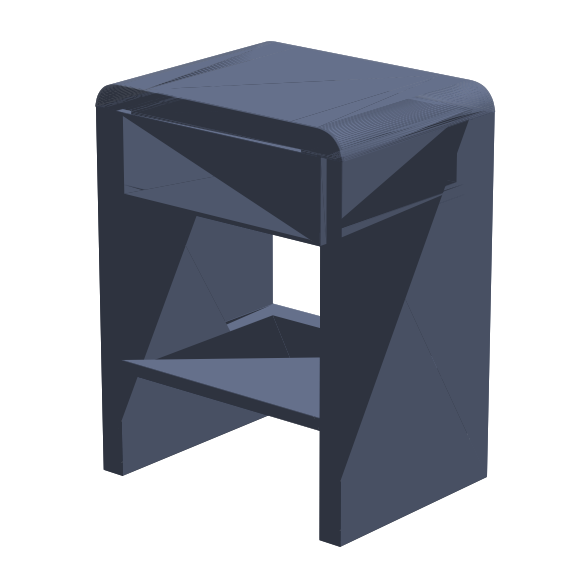

*Figure 8. The retrieval output for the same desk query that generation failed on (Figures 3b–c):
a clean, watertight mesh. This is the recommended geometry source.*

---

## 8. Conclusion and Future Work

A single silent weight-loading defect, not the algorithm, was responsible for the most visible
failures, underscoring that downstream artefacts can trace to model initialisation; we recommend
asserting zero missing keys for weights that must load. Once corrected, single-view TripoSR was
shown — qualitatively on real photos and quantitatively on a generator-favourable benchmark — to be
structurally inadequate for BIM-grade furniture, while a real catalog mesh outperforms it by 2–6×.
For practitioners forced to generate, rembg is the better front-end than SAM 2. The actionable path
is detection plus retrieval, contingent on repairing the retrieval index. Future work: a multi-view
generative bake-off (InstantMesh, TRELLIS) on cloud hardware to quantify whether multi-view methods
clear the single-view ceiling, and a multi-photo photogrammetric pilot for out-of-catalog objects.

---

## Acknowledgements
Engineering, experiments, and drafting were carried out with AI assistance (Claude Code). All
figures are server-side renders of meshes produced in this study or unaltered input photographs and
mask overlays; none are illustrations.

## References

[1] D. Tochilkin et al., "TripoSR: Fast 3D Object Reconstruction from a Single Image," Stability AI / Tripo AI, 2024. arXiv:2403.02151. (MIT licence.)
[2] N. Ravi et al., "SAM 2: Segment Anything in Images and Videos," Meta AI, 2024.
[3] X. Qin et al., "U²-Net: Going Deeper with Nested U-Structure for Salient Object Detection," *Pattern Recognition*, 2020. (Backend of the *rembg* library.)
[4] M. Oquab et al., "DINOv2: Learning Robust Visual Features without Supervision," Meta AI, 2023.
[5] N. Carion et al., "End-to-End Object Detection with Transformers (DETR)," *ECCV*, 2020.
[6] L. Yang et al., "Depth Anything V2," 2024.
[7] J. Collins et al., "ABO: Dataset and Benchmarks for Real-World 3D Object Understanding (Amazon Berkeley Objects)," *CVPR*, 2022. (CC-BY-4.0.)
[8] J. Johnson, M. Douze, H. Jégou, "Billion-Scale Similarity Search with GPUs (FAISS)," *IEEE Trans. Big Data*, 2019.
[9] W. E. Lorensen, H. E. Cline, "Marching Cubes: A High Resolution 3D Surface Construction Algorithm," *SIGGRAPH*, 1987.
[10] buildingSMART International, "Industry Foundation Classes (IFC4)," ISO 16739-1:2018.
[11] J. Xu et al., "InstantMesh: Efficient 3D Mesh Generation from a Single Image with Sparse-View Large Reconstruction Models," 2024. (Apache-2.0.)
[12] J. Xiang et al., "Structured 3D Latents for Scalable and Versatile 3D Generation (TRELLIS)," Microsoft, 2024. (MIT.)
[13] S. van der Walt et al., "scikit-image: Image Processing in Python," *PeerJ*, 2014. (Marching Cubes, Lewiner variant.)
[14] T. Lewiner et al., "Efficient Implementation of Marching Cubes' Cases with Topological Guarantees," *Journal of Graphics Tools*, 2003.

---

## Appendix A. Reproducibility / Artifacts

- **Code (defect fix and tooling):** `backend/triposr/tsr/system.py` (auto-detecting loader);
  `backend/python-scripts/{inference_base, createIFCFurniture, _triposr_postprocess, run_triposr}.py`;
  `backend/python-scripts/{batch_abo_test, build_abo_gallery, score_abo_test, render_glb_preview}.py`.
- **Benchmark data:** `outputs/abo_test/` (75 meshes + posters), `outputs/abo_test/results.json`,
  `outputs/abo_test/scores.json`.
- **Interactive viewers (served at :3000):** `outputs/view_abo_gallery.html` (75 orbit-able meshes).
- **Figures:** `report_assets/` (fig01–fig11), all real outputs of this study.
- **Environment:** RTX 4050 Laptop 6.4 GB; `transformers` 5.5.4; Marching Cubes 256³.
