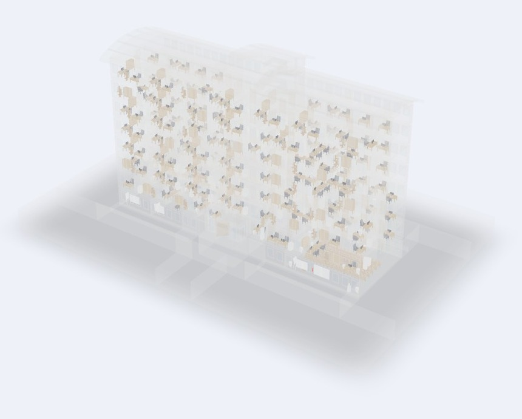

# SCS Studio — 3D Picture → IFC Modeling

<p align="center">
  
  <br>
  <em>X-ray of a populated 8-storey office tower — 805 pieces placed by the CP-SAT solver under German ASR workplace law, furniture visible through the ghosted building shell.</em>
</p>

   

> **A main, fully finished project by [Dimitres Kisimov](https://github.com/Dimitres-Kisimov).**
> One photo in → a furnished, German-workplace-law-compliant BIM building out — shipped
> through four tagged releases (v1 pipeline → v2 editing & safety → v3 room parity →
> v4 procurement & ROI), every claim test-gated, downloadable below.

**Photo-to-BIM pipeline**: converts a single 2D photograph into a watertight, real-dimensioned,
BIM-classified 3D object — then composes those objects into ergonomically furnished rooms and
whole buildings, exported as optimized IFC4.

**One app** (`npm start` → http://localhost:3000, or double-click `SCS_Studio.bat`), three
workspaces sharing one 3D viewport, plus a full **Research & Comparisons hub** (`/hub.html`,
9 guided steps) documenting every experiment behind it.

📦 **Just want to run it?** Grab the ~512 MB `*_lite.zip` from
[**Releases**](https://github.com/Dimitres-Kisimov/3DpicToIFCModeling/releases), unzip,
double-click `SCS_Studio.bat` — it self-installs on first run.

<details>
<summary><b>✨ Feature highlights across the four releases (click to expand)</b></summary>

- **Photo → 3D**: five AI engines benchmarked on 187 photos (TripoSR runs locally); broken
  meshes repaired with parametric chair-base grafts; every object auto-registered with a
  professional code (`desk-TSG-042`).
- **Rooms**: 18 selectable room types (offices → kitchens → server rooms, DE/EN), engine
  suggestions at three densities, collision checker with 0.90 m walking paths, honest refusals.
- **Buildings**: drop ANY IFC — 1,506 rooms across the 15-building demo fleet auto-classified
  (DIN 277, four languages) and furnished in minutes; floor-by-floor 2D/3D navigation.
- **Editing everywhere**: drag with live legality, 90° yaw rotation (R / ⟳ / Ctrl+right-click),
  delete-everywhere, lock/unlock — all baked into the exported IFC.
- **German ASR compliance, cited**: staffing caps (§5(3) ArbStättV), movement areas, route
  widths, protected access to fire extinguisher & first aid — mapping in
  [`docs/ASR_COMPLIANCE.md`](docs/ASR_COMPLIANCE.md).
- **🛒 Procurement (v4)**: pick or drop any generated object → multi-company market sweep
  (IKEA · OTTO · POCO live; eBay & Google Shopping via keys) → CLIP visual matching →
  cheapest visually-similar product **landed in Heilbronn**, three business tiers, finance
  Excel pack. Honest claim printed on every report. [`docs/PROCUREMENT_METHOD.md`](docs/PROCUREMENT_METHOD.md)
- **📊 ROI**: measured, downloadable — one room 59% time saved, a 6-storey office 95.3%,
  the whole fleet 95.9% ([`docs/roi/`](docs/roi/)).
- **Proof**: e2e 8/8 · floor dissection 15/15 · ergonomics 40/40 ×2 · exact-geometry meter
  over ~6,000 pieces · boot-verified release bundles.

</details>

| Workspace | What it does |
|-----------|--------------|
| 📷 **Generate object** | photo → AI 3D → dimensioned, IFC-classified mesh. Every generated object passes the repair → IFC4-validation gate and auto-registers into the catalog (badge **OURS** + engine badge, rendered thumbnail). |
| 🛋️ **Build a room** | pick furniture (515 ABO meshes + 605 engine-generated items + your own); the **people-aware CP-SAT solver** places it with legroom / door-swing / bed-access clearances, 4-way facing, back-to-wall and circulation checks — or reports honestly, per item, that there is **not enough space**. Fine-tune on the 2D floor plan (drag, exact X·Z·rotation, live collision, live 3D sync); export CSV / GLB / one optimized IFC. |
| 🏢 **Building** | load a real architectural IFC; every `IfcSpace` gets a smart, space-aware furniture set placed around the building's own walls, beams, columns and doors — clash-free, per-floor navigable, drag-to-refine, saved as GLB. |

---

## Quick start — what needs to happen for this to work

**Prerequisites:** Node.js ≥ 18 · Python 3.11–3.14 · (optional) NVIDIA GPU, driver ≥ 520.
Everything below is required once; afterwards `npm start` is the only command.

```bash
# 1. clone + Node dependencies (Express, xeokit)
git clone https://github.com/Dimitres-Kisimov/3DpicToIFCModeling.git
cd 3DpicToIFCModeling
npm install

# 2. Python dependencies
pip install torch torchvision --index-url https://download.pytorch.org/whl/cu126   # GPU
#   (no NVIDIA GPU? drop the --index-url flag — everything runs CPU-only, slower)
pip install -r requirements.txt
pip install transformers ultralytics "rembg[cpu]" ifcopenshell huggingface_hub shapely ortools

# 3. runtime config — defaults work out of the box
cp .env.example .env        # PORT=3000 · USE_GPU=true|false · PYTHON_PATH=python

# 4. ABO furniture library (retrieval catalog for "Build a room") — one-time, ~4.7 GB
python backend/python-scripts/download_abo_subset.py
python backend/python-scripts/build_abo_index.py       # DINOv2 + FAISS retrieval index

# 5. run
npm start                   # → http://localhost:3000
```

**Included in the repo** (nothing to fetch): the 605-item engine-generated catalog
(`data/generated_assets/`), all six demo buildings (`sample_buildings/`, `data/buildings/`),
the AI asset library, the full benchmark evidence (`benchmark/`), and the research hub.

**Downloaded automatically on first use** (cached by HuggingFace):

| Model | Size | Cache |
|-------|------|-------|
| stabilityai/TripoSR | ~1.3 GB | `~/.cache/huggingface/` |
| Intel DPT dpt-hybrid-midas | ~470 MB | `~/.cache/huggingface/` |
| rembg U²-Net | ~176 MB | `~/.u2net/` |
| yolov8n-seg.pt | 6 MB | repo root (committed) |

> **CPU-only fallback:** with `USE_GPU=false`, TripoSR runs on CPU (~10–20 min per image
> instead of ~1–3 min). Room and building population are **pure CPU by design** — no GPU ever.

---

## Research & Comparisons hub — `/hub.html`

Every experiment, benchmark and before/after, served from the same app:

- 🌐 **Interactive 3D Building Explorer** — all six populated buildings in live 3D
  (face-view buttons + NavCube, colored real-dimensioned furniture, 0 clashes,
  exact-geometry verified)
- 🧾 **A/B lists 01–11** — 187 internet photos × every engine, with renders, watertightness,
  IoU stats and deep links into the spinning **Multi-AI Visualizer** (998 variants, engine
  emblems, 90° rotate, winner voting)
- 🏆 **5-model gallery** — TripoSG · SAM 3D · TRELLIS · InstantMesh · TripoSR on identical
  inputs (H200 study; A100 re-run reproduces F-scores within 0.003)
- 📖 **Engine manuals** — battle-tested install recipes, fix tables and lessons learned for
  13 engines (`deliverable/manuals/`)
- 🪑 chair-graft, smoothing, leg-size and IFC-optimizer before/afters; system test report

**Offline export:** `deliverable/research_export.zip` (281 MB) packages the entire hub for
people without GitHub — unzip, double-click `START_WINDOWS.bat`, done. Rebuild it anytime by
re-running the staging steps in the export README.

### Engine benchmark (Study C, A100 80GB, 187 photos — F-score ↑)

| Engine | F-score | License status |
|--------|---------|----------------|
| **TripoSG** | **0.390** | MIT — production |
| TRELLIS 1.0 | 0.346 | MIT — production (geometry-only export) |
| InstantMesh | 0.342 | benchmark-only (Zero123++ CC-BY-NC dep) |
| SF3D | 0.290 | Stability community license |
| TripoSR (baseline) | — | MIT — the original engine, superseded |

Model selection criteria, the HuggingFace census (625 → 11 EU-usable) and every elimination
are documented in [`docs/MODEL_REQUIREMENTS_AND_ELIMINATIONS.md`](docs/MODEL_REQUIREMENTS_AND_ELIMINATIONS.md)
and [`docs/HF_CENSUS_2026-07.md`](docs/HF_CENSUS_2026-07.md). Nothing enters the catalog without
passing repair → `saveIFC` → **IFC4 validation**; per-engine IFC evidence lives in `benchmark/ifc/`.

---

## Building-scale population

`populate_building.py` reads every `IfcSpace` (name, true footprint, floor level), extracts the
obstacles intruding into each room (walls, beams, columns, stairs — **z-filtered to that room's
own storey**) plus door keep-clear zones, and runs the CP-SAT ergonomic solver
(`spatial_layout.py` + `rule_packs.py`; **ASR A1.2/A1.8 (Arbeitsstättenrichtlinie) for offices — default**,
Neufert / Panero-Zelnik / ADA clearances, circulation, no-overlap) to place furniture around them.

Robustness earned on real files:

- **Rotated buildings** — the rue-Marc-Antoine export models every wall at 60.4° to the world
  axes; the solver detects the rotation, solves in a de-rotated frame and rotates placements back.
- **Non-rectangular rooms** — L-shapes and internal voids are blocked via the space's true
  footprint polygon, not its bounding box.
- **Colored, real-dimensioned furniture** — per-material parts with baked PBR colors
  (xeokit renders no vertex colors), every asset normalised to its category's real Neufert
  dimensions.
- **Honest reporting** — items that don't fit are listed per room (`dropped`), never forced.

```bash
python backend/python-scripts/populate_building.py sample_buildings/Duplex_Architecture.ifc outputs/duplex_populated.glb
```

Verified across all six bundled buildings (exact polygon-intersection checks, not just
bounding boxes): Duplex 8 rooms / 34 pieces, Schependomlaan (4 storeys) 34 rooms / 76 pieces,
Kleine Wohnung 10 rooms / 30 pieces, COPROPIETE 16 pieces — **0 real clashes everywhere**.

---

## Stack

| Layer | Technology |
|-------|-----------|
| Server | Node.js 24 + Express |
| Frontend | Vanilla JS + xeokit SDK v2.6 (local npm install, WebGL) |
| AI inference | Python subprocess bridge (JSON I/O), GPU optional |
| 3D reconstruction | TripoSR (default) · TripoSG · TRELLIS · SF3D · SAM 3D (cloud-benchmarked) |
| Retrieval | DINOv2 embeddings + FAISS over the ABO library |
| Segmentation / depth | rembg (U²-Net), YOLOv8-seg, Intel DPT |
| Layout solver | Google OR-Tools CP-SAT + shapely |
| Mesh processing | trimesh, scikit-image, scipy |
| IFC | IfcOpenShell (import, export, optimizer, IFC4 validation gate) |

---

## Project structure

```
3DpicToIFCModeling/
├── backend/
│   ├── server.js                  # Express entry point + static mounts
│   ├── routes/                    # /api: upload, generate, rooms, buildings, export
│   ├── services/pythonBridge.js   # spawns Python, parses JSON
│   ├── python-scripts/
│   │   ├── run_triposr.py         # photo → mesh pipeline
│   │   ├── repair_mesh.py …       # 7-archetype, 9-stage repair packs
│   │   ├── spatial_layout.py      # CP-SAT room solver
│   │   ├── rule_packs.py          # Neufert/Panero/ADA ergonomics
│   │   ├── populate_building.py   # whole-building population (CPU)
│   │   └── saveIFC.py             # IFC4 export + validation gate
│   └── triposr/                   # TripoSR source (MIT), marching-cubes patched
├── frontend/                      # SCS Studio + research hub + viewers/explorer
├── benchmark/                     # 11 A/B lists, visualizer, results, per-AI IFC evidence
├── data/
│   ├── generated_assets/          # 605-item engine-badged catalog (committed)
│   ├── buildings/                 # uploaded building IFCs (committed)
│   └── mesh_library_abo/          # ABO retrieval library (built locally, step 4)
├── deliverable/                   # manuals, cloud bundle, asset library, research export
├── docs/                          # user guide, security & compliance, engineering record …
├── sample_buildings/              # bundled demo IFC
├── package.json · requirements.txt · .env.example
```

---

## API endpoints

| Method | Path | Description |
|--------|------|-------------|
| `POST` | `/api/upload` | upload image → `imageId` |
| `POST` | `/api/generate` | run AI model → GLB URL |
| `GET`  | `/api/status/:jobId` | poll generation job |
| `GET`  | `/api/rooms/:bid` | building's rooms + smart furniture suggestions |
| `POST` | `/api/building/:bid/populate` | populate a building (per-room picks optional) |
| `POST` | `/api/export/ifc` | export current scene to optimized IFC4 |
| `GET`  | `/api/health` | dependency version check |

---

## Documentation

| Document | Content |
|----------|---------|
| [`docs/DEVELOPER_MANUAL.md`](docs/DEVELOPER_MANUAL.md) | the complete map: where every functionality lives, invariants, extension recipes, troubleshooting |
| [`docs/USER_GUIDE.md`](docs/USER_GUIDE.md) | every tab, badge and button, with screenshots |
| [`docs/APP_FUNCTIONALITY_DEEP_DIVE.md`](docs/APP_FUNCTIONALITY_DEEP_DIVE.md) | every component, roadblock and fix, incl. photo-taking guidance |
| [`docs/ENGINEERING_RECORD.md`](docs/ENGINEERING_RECORD.md) | TripoSR limitations, why training your own model is hard, 12-engine training-environment comparison, room-logic strengths/weaknesses |
| [`docs/MODEL_REQUIREMENTS_AND_ELIMINATIONS.md`](docs/MODEL_REQUIREMENTS_AND_ELIMINATIONS.md) | company criteria, royalties, licences, system load — and every eliminated model |
| [`docs/SECURITY_COMPLIANCE.md`](docs/SECURITY_COMPLIANCE.md) | licence audit method, EU territory exclusions, data handling |
| [`docs/CAMPAIGN_LOG_2026-07-11.md`](docs/CAMPAIGN_LOG_2026-07-11.md) | the full A100 benchmark campaign log |
| [`deliverable/manuals/`](deliverable/manuals/) | 13 engine manuals + ops playbook |
| [`docs/BUILDINGS_PROVENANCE.md`](docs/BUILDINGS_PROVENANCE.md) | licence verification for every building in the fleet |
| [`docs/ASR_COMPLIANCE.md`](docs/ASR_COMPLIANCE.md) | Arbeitsstättenrichtlinie implementation with legal citations |
| [`docs/archive/`](docs/archive/) | historical session reports, handoffs and early papers |

---

## Known issues

- **Python 3.14**: `torchmcubes` has no wheels — patched with `skimage.measure.marching_cubes`
  in `backend/triposr/tsr/models/isosurface.py`
- **xeokit vertex colors**: the GLTF loader ignores `COLOR_0` — all colors are baked as GLTF
  PBR `baseColorFactor` materials (this is handled automatically everywhere)
- **Geometry-only engine exports** (TRELLIS et al.) carry no textures; catalog items from them
  get realistic per-category material tones instead
- **TripoSR orientation**: upside-down output is corrected by a Y-centroid heuristic; unusual
  camera angles may still need manual rotation

---

## Licenses & compliance

| Component | License |
|-----------|---------|
| This project | MIT |
| TripoSR (Stability AI) / TripoSG / TRELLIS | MIT |
| SF3D | Stability community license |
| xeokit SDK | AGPL-3.0 / commercial |
| YOLOv8 (Ultralytics) | AGPL-3.0 |
| IfcOpenShell | LGPL-3.0 |
| PyTorch / rembg / trimesh | BSD-3 / MIT / MIT |

> **Commercial use:** xeokit SDK and YOLOv8 are AGPL-3.0 — closed-source commercial deployment
> requires commercial licences from xeokit.io and Ultralytics.
> **Territory compliance:** Hunyuan3D-family models are excluded entirely (EU territory
> restriction — no research carve-out). Full audit: [`docs/SECURITY_COMPLIANCE.md`](docs/SECURITY_COMPLIANCE.md).
