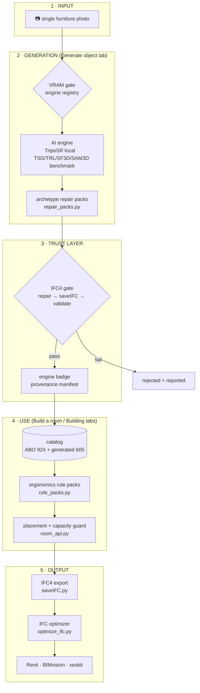
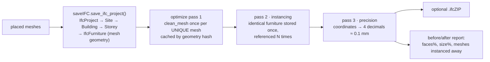

# SCS Studio — Complete Functionality Deep Dive

**Every component, every function, what it does, and how the user experiences it.**
Companion to [USER_GUIDE.md](USER_GUIDE.md) (the quick tour); this document is the
full functional specification for the paper. Every function named here exists in
the repository at the cited path.

---

## 1. What the app is, in one diagram

The five stages implement one promise: **anything a user can place in a room has
been generated, repaired, validated, and labeled with its origin.**

---

## 2. THE PHOTO — why how you take the picture decides everything

Single-image 3D is an information problem: the camera sees at most **three faces**
of an object; the AI must *hallucinate* the rest. Everything downstream — mesh
quality, repair success, even whether generation runs at all — is decided the
moment the shutter clicks.

### 2.1 The per-category angle table (in-app at `/benchmark/angles.html`)

| Items | Ideal angle | Why |
|---|---|---|
| Desk · Table · Coffee/Side Table · Stool | ¾ front (30–45° off), elevated ~15–20° | top surface AND all legs visible — the least for the model to hallucinate |
| Office chair | ¾ front at seat height | the base is rebuilt parametrically anyway; give the model a clear seat and back |
| Sofa | ¾ front, ~10° up, full length in frame | shows seat, arm and back planes |
| Cabinet · Filing cabinet · Bookshelf | ¾ front ~30°, camera at half height, doors closed | two crisp faces; open wire cages reconstruct poorly |
| Lamp · Planter | ¾ side against a plain wall, lamp OFF | whole pole/stem visible; a lit lamp breaks segmentation |
| Monitor / Laptop | monitor: frontal · laptop: ¾ front open ~110° | these become slabs/L-shapes; face detail matters most |
| Mirror · Picture frame · Clock | frontal, tilted 5–10° (mirror: don't reflect yourself) | wall panels flatten to slabs; frontal maximizes face detail |

### 2.2 Universal photo rules (and the measured reason for each)

| Rule | What happens if you break it |
|---|---|
| ONE object, fully in frame, ~10% margin | cropped legs → the support-rebuild has no evidence to work from |
| plain contrasting background | segmentation bleeds; benchmark mirrors failed with *empty foreground* (`list08_mirror`, deterministic) |
| even diffuse light, no harsh shadows | shadows read as geometry → phantom bumps |
| camera at ~half the object's height | extreme angles hide a whole face → hallucinated back |
| colour photo | grayscale (mode-'L') crashed an entire engine batch until the app forced RGB (campaign-verified 2026-07-12) |
| two faces + the top visible | the symmetry repair can mirror what it sees — the best photo gives it a whole half to mirror |

### 2.3 What the repair layer can and cannot rescue

The repair packs **compensate for predictable single-view damage** — asymmetric
legs (mirrored back), hallucinated backs (symmetrized), noisy topology (smoothed,
watertighted), fragmented supports (rebuilt parametrically from detected footprints).
They **cannot invent what was never photographed**: an occluded drawer face,
a lit lamp's true shade shape, or a mirror's real frame behind its reflection.
The photo-angle guide exists because the cheapest quality upgrade in the entire
pipeline is a better photograph.

---

## 3. Generate object — component by component

| UI element | Backend function | What it does |
|---|---|---|
| Upload box (drag & drop) | Express upload route → local disk | accepts jpg/png; nothing leaves the machine |
| *Try a sample chair* | `/sample` static mount | one-click demo without a photo |
| **Quality selector** | engine registry in backend config | lists only engines whose VRAM floor ≤ your GPU: a 6 GB laptop sees TripoSR; a 24 GB tower sees more — **selection can never crash the machine** |
| *"This is an office chair …"* checkbox | `repair_packs.resolve_archetype()` | activates the category's repair pack; e.g. office chair adds the parametric 5-star base graft |
| Progress list (5 stages) | pipeline stages | *Finding the object* (segmentation) → *Measuring real size* (scale estimate) → *Matching a 3D shape* → *Building high detail* (the engine) → *Finalizing* (repair + registration) |
| Your models → ↻ Rotate 90° | `fixOrientation.py` / rot=(rot+90)%360 | same rotation logic reused in the visualizer cards |
| Your models → ✕ | manifest delete | removes the generated item everywhere |
| (automatic) | `room_api.py` upload path | seat categories are canonicalized **upright** (photo-3D seats arrive tilted); a thumbnail is rendered once and cached; the item enters the catalog with `engine` + <kbd>OURS</kbd> badge |
| **▶ Demo run** | scripted end-to-end | photo → mesh → room placement → IFC, for presentations |

### The repair pack, stage by stage (`repair_packs.py`)

Measured effect (Study B, 170 internet photos): faces **111k→12k**, watertight
**→91%**, 48 broken bases rebuilt. Honest trade: five legged/swivel categories
lose a little silhouette IoU (−0.026…−0.071) — the pack optimizes BIM-validity,
not silhouette fidelity, and the paper says so.

---

## 4. Build a room — the ergonomics engine

### 4.1 The picker (per category "⋯ pick")

Three source types, visually distinct:

| Source | Count | Badge | Origin |
|---|---|---|---|
| ABO catalog | 924 meshes | none (thumbnail) | Amazon Berkeley Objects, CC-BY-4.0, per-item attribution |
| Generated (campaign) | 605 | <kbd>TSG</kbd> <kbd>TRL</kbd> <kbd>SF3D</kbd> <kbd>SAM3D</kbd> <kbd>IM</kbd> | benchmark engines, every item through the IFC4 gate |
| Generated (yours) | grows as you use the app | <kbd>OURS</kbd> | your photos via the Generate tab |
| Parametric | fallback | prim | procedural stand-ins (laptop, monitor) |

`catalog.list_items()` merges ABO + the generated overlay; `_generated_items()`
carries the `engine` field that renders the badge — provenance is data, not styling.

### 4.2 Placement intelligence (`rule_packs.py` + `room_api.py`)

Every category resolves to a **behavioral role**, so the engine is object-agnostic:

| Role | Categories | Placement behavior |
|---|---|---|
| worksurface | desk, table, dining table | chairs get pull-out clearance behind them; person-space around |
| lounge_seating | sofa, couch, bench | faces into the room; TV/frames opposite |
| on_surface | monitor, laptop, keyboard | placed ON a worksurface, **facing the sitter** (never turned away — user-specified rule) |
| wall_mounted | mirror, picture frame, clock, TV | frames at eye level; clock high on the wall **opposite the chair**; mirror never colliding with furniture |
| floor_accent | planter | beside mirror/desk, out of walkways |
| ring_seating | stool | **petal pattern** around tables, count-adaptive |

Per-category clearance margins are numbers, not vibes (excerpt from the pack):
table 0.15 m · sofa 0.20 m · cabinet 0.20 m · stool 0.10 m · wall items 0.05 m.

**Capacity guard:** floor area is the *only* budget (the old 30-item cap is gone).
The solver computes footprint + clearance per requested item and refuses overflow
with an explicit *"not enough space for X"* message instead of a silent cram.
**Clash validation** is room-scoped and survives non-rectangular rooms.

### 4.3 Room outputs

- **📥 Download all as one IFC** → `saveIFC.save_ifc_project()` then the optimizer
  runs automatically (see §6).
- **🧼 Clear & redo** resets placement, keeps your picks.
- X-ray/lighting toggles for inspection.

---

## 5. Building — whole-structure population

| Function | Implementation | User experience |
|---|---|---|
| Shell loading | duplex sample + **IFC dropbox** | drop your own building IFC; contents auto-categorized |
| Per-floor navigation | floor selector → 2D plan / 3D view | "see the whole building, pick a floor, see it flat or deep" |
| Room teleport | click a room in 2D | camera jumps inside in 3D |
| Population | same rule packs per room | ergonomics apply room-by-room |
| Fleet capture | `build_building.py` + clash audit | screenshot series of every floor for review |
| Export | one populated IFC, optimizer applied | opens in Revit/BIMvision |

---

## 6. The export chain — from mesh to BIM

The optimizer is **automatic on download** — no button, no extra step. For a room
with six identical chairs, pass 2 alone stores the chair geometry once instead of
six times.

**The IFC gate** (`benchmark/ingest_pod_results.py`) runs the same exporter in
reverse-trust mode: any external mesh (benchmark engines, future engines) must
survive repair → export → IFC4 validation (`ifcopenshell` schema + product check)
before touching the catalog; rejects are reported in `ingest_report.csv` — the
gate's pass rate per engine is itself a published comparison metric.

---

## 7. The Research hub — evidence, in-app

| Page | Function | Key interactions |
|---|---|---|
| `/benchmark/visualizer.html` | 187 items × up to 9 variants in live 3D | comparison-group tabs · engine emblems · ↻90°/⤴90° · **Select this one** voting · selections.json export · `#list05/desk` deep links · dimmed chips auto-jump |
| `/benchmark/index.html` + lists 01–11 | 2D skim of every item row | photo → TripoSR → repair → TSG → TRL → SF3D columns with faces/watertight/IoU pills |
| `/benchmark/angles.html` | the photo guide (§2) | shooting instructions per category |
| `/manuals.html` | 13 engine manuals | verified fix tables, licences, VRAM floors |
| `/gallery/` | the H200 5-model study | the original Study A evidence |

The visualizer's votes are the **human-evaluation channel**: exported picks can
drive per-category engine routing (the shape-class router: measured evidence says
TripoSG wins stools at 0.993, InstantMesh wins flat tables at 0.83).

### The 8-way upgrade menu (user-pickable processing profiles)

On the list05 samples, TripoSG meshes appear in 8 processing variants — repair-only,
three smoothing styles (Taubin edge-preserving, Laplacian soft, Humphrey
volume-preserving), lean 5k decimation, and photo-colour tints (dominant-colour
extraction — *mean* colour was tried and produces mud; documented). The user's
winning profile becomes the catalog-wide default.

---

## 8. Trust & performance systems (invisible until needed)

| System | Trigger | What the user sees |
|---|---|---|
| VRAM gate | app start (GPU probe) | small machines simply see fewer engines |
| Capacity guard | populate request | "not enough space" instead of a frozen solver |
| IFC gate | any generated mesh → catalog | only valid items ever appear |
| Upright canonicalization | photo-3D seat upload | chairs never lie on their backs |
| Engine badges | manifest `engine` field | provenance on every generated thumbnail |
| Auto-optimizer | IFC download | smaller files, no action needed |
| Preflight/postcheck (ops) | benchmark campaigns | fabricated results structurally impossible |

---

## 9. Honest limits (what the app does NOT do)

- Single-photo generation cannot recover unphotographed geometry (see §2.3).
- Mirrors defeat foreground segmentation — a documented, deterministic failure.
- TripoSG-class engines output **untextured** geometry; single-colour tinting is
  the ceiling without a textured engine (SF3D is textured; TRELLIS's texture path
  is licence-blocked — geometry-only by design).
- Multi-photo input (Mode 2) is designed and researched, awaiting Study E's run.
- TRELLIS 2.0 has never generated: software-proven, blocked on a third-party
  access grant.

*Cross-references: [USER_GUIDE.md](USER_GUIDE.md) · [COMPARATIVE_ANALYSIS.md](COMPARATIVE_ANALYSIS.md) ·
[SECURITY_COMPLIANCE.md](SECURITY_COMPLIANCE.md) · [MULTI_IMAGE_RESEARCH.md](MULTI_IMAGE_RESEARCH.md) ·
deliverable/manuals/ (per-engine truth).*
