# The Engineering Record — solved, blocked, fixed, and honestly limited

**The complete story behind every function: what we built, what broke, what it
cost, and what the system still cannot do.** Written for the thesis; every claim
cites a repo artifact. Companion documents: [APP_FUNCTIONALITY_DEEP_DIVE.md](APP_FUNCTIONALITY_DEEP_DIVE.md)
(what each component does), [MODEL_REQUIREMENTS_AND_ELIMINATIONS.md](MODEL_REQUIREMENTS_AND_ELIMINATIONS.md)
(model selection), deliverable/manuals/ (per-engine fix tables).

---

## 1. The pipeline, 100% explicit

```mermaid
flowchart LR
    A[photo] --> B[segmentation\nrembg / SAM2]
    B --> C[scale estimate\nDepth-Anything-V2-Small]
    C --> D[generation\nTripoSR local / cloud engines]
    D --> E[repair packs\n9 stages, repair_packs.py]
    E --> F[upright registration\nseat canonicalization]
    F --> G[IFC4 gate\nsaveIFC + ifcopenshell validate]
    G --> H[(catalog + engine badge)]
    H --> I[room solver\nrule packs + capacity guard]
    I --> J[building population\nper-floor, clash-audited]
    J --> K[IFC export + optimizer\nclean/instance/precision]
```

| Stage | Solved | The roadblock we hit | The fix (committed) |
|---|---|---|---|
| Segmentation | object isolated from any background | mirrors return an EMPTY foreground (deterministic); grayscale photos crashed a whole engine batch | documented failure class; force-RGB staging everywhere (verified 2026-07-12) |
| Generation | one photo → mesh in ~55 s on a 6 GB laptop | see §3 — the TripoSR quality wall | engine selector + benchmark campaign + repair layer |
| Repair | 111k→12k faces, 91% watertight, 48 bases rebuilt (Study B, n=170) | silhouette IoU regresses on 5 legged categories; office_chair 0/10 watertight after base-graft (desktop audit find) | trade documented; base-graft union = open v3 item |
| Registration | photo-3D seats always upright | generated chairs arrived tilted/lying | `_canonicalize_seat_upright` on upload (July 9) |
| IFC gate | nothing unvalidated reaches users | a "best-effort" script once fabricated 180 identical results | no-silent-fallback rule + preflight gates + distinct-size postcheck (§5) |
| Room solver | human-plausible layouts | early rooms: lamps floating, monitors facing walls, clashes in non-rectangular rooms | role-based rule packs + room-scoped clash validation (July 7–9) |
| Building | whole-IFC population with per-floor 2D/3D | initial single-blob navigation was unusable | floor selector + teleport + fleet capture with clash audit |
| Export | Revit/BIMvision-valid IFC4 | raw exports bloated (每 chair stored N times) | automatic optimizer: dedupe-instancing + 0.1 mm precision (measured % in report) |

---

## 2. What using a subpar AI actually cost us — the TripoSR chapter

TripoSR was chosen for one reason: it is the only engine that runs on the target
6 GB laptop (§ requirements B3). It is a 2024-era triplane LRM, and the project's
entire architecture is shaped by compensating for it.

### 2.1 The measured limits (all numbers from repo studies)

| Limitation | Evidence | Consequence |
|---|---|---|
| **Thin-shell reconstruction** — models the visible surface, barely anything behind | June-23 study: precision 0.81 / **recall 0.09** — it reproduces what it sees and almost nothing it doesn't | the single deepest limit; drove the symmetry-repair design |
| **Global quality wall** | Chamfer 0.169 / F-score 0.155 vs GT; H200 baseline 0.278–0.295 vs TripoSG 0.393 | motivated the entire cloud benchmark program |
| **Category bias — chairs are its best case** | works acceptably on chairs (compact, symmetric, well-represented in training data); desks/tables/shelves "look like ass" (user QA, July 9) — a table reconstructed as **a cube** (July 9 session) | 100-per-category ABO expansion + retrieval-first pivot |
| **Asymmetric/broken legs** | Study B: 48 of 170 items needed full support rebuilds | parametric leg/base reconstruction in repair packs |
| **Hallucinated backs** | recall 0.09 (above) | mirror-plane symmetrization stage |
| **Noisy topology** — bumps, holes, stray lines | "random holes or lines coming off of TripoSR" (July 9 QA) | debris filter + MeshFix + smoothing menu (8-way study) |
| **Fragmentation** | multi-component outputs counted in Study B stats | component filter keeps main + leg-like parts only |
| **No texture, no color** | gray meshes throughout | photo-dominant-color tinting (v6–v8 variants); true materials need a textured engine |
| **No pose, no scale** | outputs float in normalized space | Depth-based scale estimate + upright canonicalization + contact flatten |
| **Wrong proportions on unusual objects** | "the bed is not realistically measured" (July 9 QA) | dims_m estimates + catalog fallback |

### 2.2 The architectural consequences (why this mattered beyond quality)

1. **The repair-pack layer exists because of TripoSR.** Study B (170 photos) is
   literally the measurement of how much engineering it takes to make its output
   BIM-usable.
2. **The retrieval-first pivot**: the real ABO mesh scores 1.000 by definition
   vs the best generator's 0.393 — the catalog beats generation ~2.5×, so the
   product architecture became *detect → retrieve → generate-as-fallback*.
3. **The benchmark program itself** (H200 + A100 campaigns, 7 engines, ~1,000
   meshes) exists to answer "what would we gain by replacing it?" — answer:
   +0.10–0.11 F-score (TripoSG), at the cost of cloud-class VRAM.
4. **The engine-selector + VRAM gate** exists so better engines can slot in
   per-machine without abandoning the laptop baseline.

### 2.3 Why we did not train our own model (and what it would take)

Training a competitive image-to-3D model is not fine-tuning; the published
training setups make the bar explicit:

| Requirement | Typical published scale | Our situation |
|---|---|---|
| 3D training data | 0.5–2M+ curated, licensed 3D assets (Objaverse-class); heavy filtering pipelines | no licensed corpus of that scale; ABO is 8k products |
| Compute | tens-to-hundreds of A100/H100-class GPUs for days-to-weeks per run | one 6 GB laptop + rented single GPUs by the hour |
| Annotation/rendering | multi-view rendering of every asset (dozens of views × millions of assets) | render farm we don't have |
| Iterations | published models are the *survivors* of many failed runs | one failed run exceeds the entire project budget |
| Team | dedicated research groups (Meta/Microsoft/Stability/VAST) | one student |

**The economically rational strategy — proven by this project — is adaptation:**
select engines by rigorous audit, wrap them in a repair layer, gate their output,
and route by measured per-category strength (the shape-class router:
TripoSG-stools 0.993, InstantMesh-tables 0.83).

### 2.4 Training-environment comparison across the 12 audited engines

(Compiled from the models' own papers/model cards; where a value is unpublished
it is marked n.p. — do not invent it in the thesis either.)

| Engine | Params | Training data (per paper/card) | Objective | Trainer |
|---|---|---|---|---|
| TripoSR | ~0.4B LRM | Objaverse-scale renders (curated subset) | single-view triplane regression | Stability + Tripo |
| TripoSG | ~1.5B (flow) + VAE | ~2M licensed 3D assets (paper) | rectified-flow SDF | VAST-AI |
| TRELLIS 1.0 | ~1.2B (L) | ~500k Objaverse(+) assets, SLAT latents | flow on structured latents | Microsoft |
| TRELLIS.2 | 4B | scaled-up successor corpus (n.p. details) | O-Voxel flow, full PBR | Microsoft |
| SAM 3D Objects | MoT, n.p. | SA-3DAO (Meta-built; dataset CC-BY-NC) | flow-matching geometry+texture+pose | Meta |
| InstantMesh | LRM + Zero123++ | Objaverse renders; distilled from a view-synthesis diffusion | sparse-view LRM | TencentARC |
| SF3D | ~1B | Objaverse-class + material labels (n.p. exact) | fast triplane + UV/material heads | Stability |
| Direct3D-S2 | n.p. | licensed 3D corpus (n.p. scale) | sparse-SDF diffusion | DreamTech |
| Step1X-3D | 1.3B geo + 3.5B tex | ~2M assets (paper) | two-stage geometry→texture | StepFun |
| Hi3DGen | TRELLIS-derived | retrained normal-bridge on TRELLIS-class data | normal-bridged latent flow | Stable-X |
| PartCrafter | n.p. | part-annotated 3D corpus | part-compositional diffusion | PKU/CMU |
| Cupid (held) | TRELLIS-format | n.p. | pose-grounded reconstruction-fidelity gen | indep. author |

The pattern the thesis should draw: **every serious engine is trained on
million-scale licensed 3D corpora by an organization with a GPU cluster** —
the entry ticket to *training* is orders of magnitude above the entry ticket to
*adapting*, which is exactly the gap this project's methodology exploits.

---

## 3. The room logic — the complete list, strengths and weaknesses

### 3.1 What the solver actually does (rule_packs.py + room_api.py)

| # | Logic | Detail |
|---|---|---|
| 1 | **Role resolution** | every category → behavioral role (worksurface, lounge_seating, on_surface, wall_mounted, floor_accent, ring_seating); unknown objects get a role inferred from geometry (h/w/d) — the engine is object-agnostic |
| 2 | **Per-category clearances** | numeric margins (table 0.15 m, sofa/cabinet 0.20 m, stool 0.10 m, wall items 0.05 m) |
| 3 | **Human-space reasoning** | pull-out clearance behind desk chairs; walking space around tables ("imagine there are people") |
| 4 | **Facing constraints** | monitors/laptops face the sitter — never turned away; clock on the wall *opposite* the chair; sofa faces into the room |
| 5 | **Height constraints** | frames at eye level; clocks high; decor at human heights (July 7) |
| 6 | **Ring seating** | stools arrange in a count-adaptive petal pattern around tables |
| 7 | **Companion placement** | planter near mirror/desk but out of walkways; lamp on desk |
| 8 | **Capacity guard** | floor-area budget (footprint + clearance per item); refuses overflow with a named list — visible in `fleet/density_overload_blocked.png` |
| 9 | **Room-scoped clash validation** | placements checked against walls & each other per room; survives non-rectangular rooms (fixed July 9 after real failures) |
| 10 | **Reachability audit** | the object table flags "⚠ hard to reach: bookshelf" per room (visible in the X-ray capture) |
| 11 | **Zone rotation** | clearance zones rotate rigidly with the object in 90° steps (`_rot_zone_offsets`) |
| 12 | **Upright canonicalization** | photo-3D seats stored level (no tilted chairs in rooms) |
| 13 | **Duplicate-space dedup** | rooms listed twice in an IFC are populated once |

### 3.2 Strengths (measured/observed)

- **Explainable**: every placement traces to a named rule — no black box; failures
  are reported in words ("no space: table, stool"), not silently absorbed.
- **Object-agnostic**: geometry-inferred roles mean a never-seen category still
  gets sane treatment.
- **Honest under pressure**: the guard blocks overload instead of producing a
  furniture pile (the `density_overload_blocked.png` evidence).
- **Scales to buildings**: the same per-room logic populated 4 public IFC shells
  (duplex, German office, house, Schependomlaan — all in `frontend/fleet/`).

### 3.3 Weaknesses (name them in the thesis — they are future work)

- **Greedy, not globally optimal**: items place sequentially by rule; no global
  optimization pass — a different insertion order can yield a different layout.
- **No door/window semantics**: swing paths and sightlines to windows are not
  modeled; "hard to reach" is a distance heuristic, not a path-planning result.
- **Fixed constants**: eye level, wall heights, clearances are constants, not
  personas (no child/wheelchair profiles).
- **No inter-room reasoning**: each room solves independently; no flow logic
  between rooms.
- **No lighting/acoustics awareness**: a desk may back onto the room's darkest corner.
- **Aesthetics are implicit**: symmetry/style harmony is not scored.

---

## 4. Screenshot evidence index (all committed — feed these paths to the thesis AI)

| File | Shows | Caption-ready fact |
|---|---|---|
| `frontend/fleet/showcase_duplex_xray.png` | **X-ray mode**: wireframe duplex, furniture visible through walls, an **"office chair (ours)" chip placed in Bedroom 2**, object table with per-room honesty ("7/9 placed · ✗ no space: table, stool · ⚠ hard to reach") | the trust-layer UI in one image: OURS provenance + capacity guard + reachability audit |
| `frontend/fleet/showcase_duplex_floor.png` / `showcase_german_apartment_xray.png` | solid vs X-ray, second building | generality across shells |
| `frontend/fleet/duplex__Level_1_2d.png` + `_3d.png` (× all floors) | per-floor 2D plan vs 3D of the same populated state | the 2D/3D navigation contract |
| `frontend/fleet/density_duplex_dense_*` / `density_german_dense_*` | density study captures | layout quality under load |
| `frontend/fleet/density_overload_blocked.png` | **capacity guard firing** | refusal, not degradation |
| `frontend/fleet/schependomlaan__0[0-3]_*.png` | 4-storey public IFC populated | scale evidence |
| `deliverable/catalog/contact_{bookshelf,cabinet,desk,lamp,office_chair}.png` | ABO catalog contact sheets | the retrieval-first inventory |
| `docs/guide_img/*.png` | the 7 app-page screenshots | UI documentation (see USER_GUIDE) |
| `data/generated_assets/pod_*.thumb.png` | individual OURS/engine item thumbnails | catalog-item appearance |

---

## 5. The integrity systems — born from failure, now methodology

The campaign's one fabrication incident (an infer script that copied a repo asset
on failure and logged success — 180 identical "results" in 2 minutes) produced
the standing controls, now documented as a methods contribution:

1. **Preflight gate** — 1 real mesh > 50 KB before any batch spends GPU money.
2. **Identical-output postcheck** — >10 outputs with <3 distinct file sizes = fabricated.
3. **No-silent-fallback rule** — scripts produce their own output or log FAIL.
4. **IFC gate** — external meshes cannot reach users unvalidated; per-engine
   rejection rates are themselves published data (ingest_report.csv).

Full operational lessons (23 verified fix rows, the ops playbook):
deliverable/manuals/README.md.
