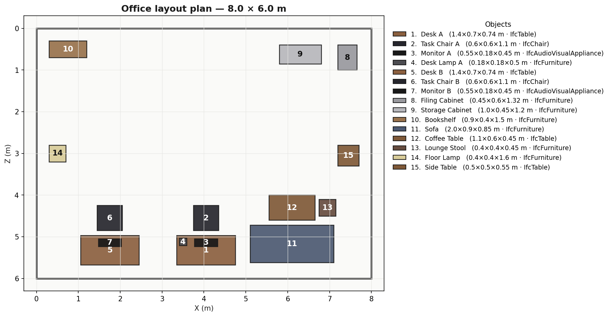
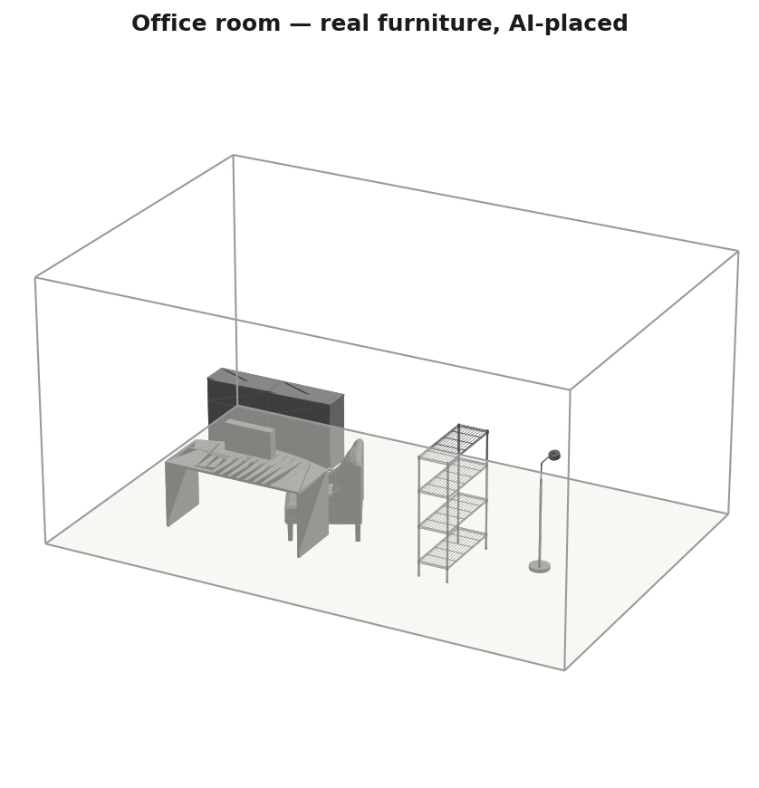

# 3DpicToIFCModeling — Findings & Build Status

_Photo → object table (2D→3D, IFC/BIM) → AI room population → xeokit viewer + export.
Commercial-safe only. Last updated: 2026-06-21._

## What this is
Scan any office object as a 2D photo → each becomes a row in an **object table**
(type, real size, material, 3D model, IFC/BIM data, source/licence). The table is
the single source of truth: you **export** from it (CSV / IFC) and an **AI lays the
objects out in a room the human way** (functional, not just non-overlapping).

## Built & validated this session (Sim B — room-population demo)
| File | Role |
|---|---|
| `backend/python-scripts/build_room_scene.py` | object table → CP-SAT layout **+ functional anchoring** → `scene.glb` + MetaModel + schedule |
| `backend/python-scripts/build_room_ifc.py` | table → **IFC4** (spatial hierarchy + typed, placed furniture + property sets) |
| `backend/python-scripts/make_scene_spec.py` | scan photos → object table (runs the detect→size→retrieve pipeline per photo) |
| `backend/python-scripts/render_scene.py` | report figures: floor plan, 4 angles, real-furniture 3D |
| `demo/room_demo.html` + `room_demo.js` | web platform: object-table grid + xeokit 3D + Export CSV/IFC + Save-image; stable camera |
| `demo/run_demo.ps1` | one-command build + serve + open |
| `backend/python-scripts/spatial_layout.py` | **fixed** for OR-Tools 9.15 interval API |

Run the demo: `powershell -ExecutionPolicy Bypass -File demo\run_demo.ps1`

## Key findings
1. **Detection is the weak link.** DETR (COCO classes) is strong on chairs/desks/tables
   but has no class for bookshelves, cabinets, lamps, monitors — so most office items
   fall to generic "furniture", making the raw scan's **category + IFC type fuzzy**.
   Retrieval still returns a real mesh. _Fix path: a furniture-specific classifier, or
   use the catalog category as a prior._
2. **Retrieval works and is the clean path.** DINOv2 + FAISS over the 400-mesh **ABO**
   catalog (CC-BY-4.0) returns real product furniture; with retrieval forced, no
   generative model is needed. `faiss-cpu 1.14.3` installs on Python 3.14.
3. **Functional layout matters.** Pure CP-SAT packing (no-overlap + clearances) does not
   make office sense. Added **functional anchoring** — chair → desk (in front, facing),
   monitor → desk (on top) — for human-sensible workstations. Extensible to facing,
   circulation paths, zones, and natural-language briefs ("meeting room for 8").
4. **Mesh orientation.** ABO GLBs are glTF **Y-up**; only the procedural primitives are
   Z-up. Fixed a double-rotation that tipped furniture onto its side.
5. **Local hardware.** RTX 4050 Laptop, **6.4 GB VRAM** — runs detection + retrieval +
   the OR-Tools solver locally; heavy single-image-to-3D (SAM 3D ~32 GB, TRELLIS) belongs
   on a capped-paid cloud GPU (Sim A).
6. **Cost (Heilbronn).** ~**€185/mo** on Hetzner GEX44, **€0 licence royalties**,
   GDPR-clean (German DC). Full model in `docs/COST_MODEL.md`.
7. **Single-photo generation (the hard step) — runs, but has a ceiling.** TripoSR
   generated a dense mesh from one chair photo in **~105 s on the 6.4 GB laptop GPU**
   (670k faces). So photo→3D of a user's *actual* object is feasible, BUT single-view
   reconstruction hallucinates the unseen back/sides — usable for client visualization,
   not for faithful BIM-grade geometry (consistent with the prior critical-analysis
   paper). Levers: multi-view photos (biggest), background removal (done), texture
   projection, and SAM 3D/TRELLIS on 32 GB. **Quantifying real quality across all four
   generators is exactly what Sim A (`cloud/compare_4way.sh`) measures.** Note: IFC/BIM
   compliance rides on detection + dimensions, not mesh fidelity — so it's more tractable
   than perfect geometry.

## Licence posture (commercial-safe only)
Permissive MIT/Apache/BSD; no non-commercial, no revenue caps, no EU exclusion.
**Allowed:** TripoSR (MIT), InstantMesh (Apache-2.0), TRELLIS (MIT), SAM 3D Objects
(SAM licence, commercial OK), Depth Anything V2 **Small** (Apache-2.0), ABO (CC-BY-4.0),
OR-Tools (Apache-2.0), xeokit-sdk (MIT), faiss, ifcopenshell.
**Rejected:** Hunyuan3D-2 (EU excluded), Stable Fast 3D ($1M cap), Wonder3D (CC-BY-NC),
YOLOv8/Ultralytics (AGPL).

## Two simulations
- **Sim A — 3D-model bake-off** (SAM 3D / TRELLIS / TripoSR / InstantMesh on the office
  set): `cloud/compare_4way.sh`, run on a capped-paid RunPod A40/A100 (~$0.35, $20 cap).
  Picks the generative fallback; feeds the paper.
- **Sim B — room population** (this build): validated end-to-end.

## Status
| Workstream | State |
|---|---|
| Sim B room-population demo | ✅ built + validated |
| Real photo-scan (6/6 retrieved) | ✅ runs end-to-end; detection gap documented |
| Functional layout (chair@desk, monitor@desk) | ✅ added |
| Sim A 3D bake-off | ▶ `compare_4way.sh` ready; run on capped cloud GPU |
| Layout-AI method survey | ▶ in progress (deep research) |
| Research paper + SCS deck | ☐ pending |

## Figures

