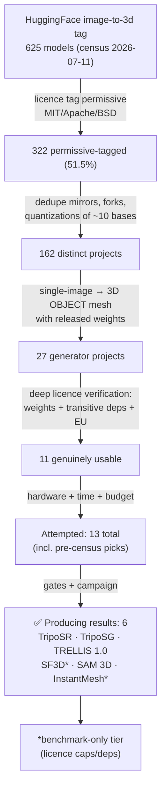

# Model Requirements & Eliminations — the complete selection record

**Which AIs we attempted, which we eliminated, at which stage, and against which
requirement.** Consolidates Stages 1–8 of [HUGGINGFACE_MODEL_NARROWING.md](HUGGINGFACE_MODEL_NARROWING.md),
the census ([HF_CENSUS_2026-07.md](HF_CENSUS_2026-07.md)), and the A100 campaign
gate results (2026-07-11→12).

---

## 1. The funnel, end to end

Note on the early "boiled down from ~7k" claim: that described **all of
HuggingFace** at Stage 1–2 scope (every pipeline tag we screened for any pipeline
role); the 625 figure is the **image-to-3d tag alone** at census time. Different
scopes, both correct, reconciled here for the paper.

---

## 2. The requirement list (the company's bar, in checkable form)

### A. Legal / company requirements (SCS, Germany — hard gates)
| # | Requirement | Rationale | Kills on failure |
|---|---|---|---|
| A1 | Commercial use granted outright — **no royalties, no revenue caps** | company monetizes outputs | SF3D/SPAR3D ($1M cap → benchmark-only) |
| A2 | **No territory exclusion** — the EU must be licensed | team operates in Germany | Hunyuan3D family (EU excluded, *no research carve-out*), Pixal3D (MIT but EU-download-blocked) |
| A3 | No NonCommercial / research-only terms | same | DUSt3R/MASt3R/VGGT/Fast3R/CUT3R/Spann3R/MUSt3R/Pow3R/Pi3, Wonder3D, apple/Sharp, PartPacker, Depth-Anything-V2 B/L, OpenLRM, vfusion3d |
| A4 | No viral copyleft on shipped code (AGPL/GPL) | closed distribution planned | CraftsMan3D (AGPL *weights*), Era3D, OpenMVS, OpenSplat, YOLO |
| A5 | Licence verified on **weights AND code AND transitive deps**, quoted verbatim | tags lie — proven repeatedly | InstantMesh (Zero123++ NC dep → benchmark-only), Kiss3DGen (FLUX NC dep), Amodal3R (NC code), UltraShape/Miro (apache tags over Hunyuan bases), TRELLIS texture path (Inria/NVIDIA NC submodules → geometry-only) |
| A6 | Attribution obligations must be dischargeable | CC-BY is fine (ABO catalog) | — |

### B. Technical requirements
| # | Requirement | Rationale | Kills on failure |
|---|---|---|---|
| B1 | Single photo → 3D **mesh** (or trivially meshable) | IFC needs geometry | TripoSplat/TriplaneGaussian/LGM (splats), MoGe (2.5D), TripoSF (mesh-in) |
| B2 | Released, downloadable weights (no waitlist/API-only) | reproducibility | SpaRP, Seed3D, Sparc3D (never released) |
| B3 | Product path must run on **consumer VRAM** (dev box 6 GB; gate hides heavier engines) | end users have laptops | SAM 3D (≥32 GB → cloud/benchmark only), Step1X-3D (27–29 GB) |
| B4 | Deterministic seeding | scores must reproduce | verified: A100 reproduced H200 within 0.003 |
| B5 | Output survives the repair → **IFC4 validation** gate | BIM is the product | gate pass-rate is tracked per engine (ingest_report.csv) |

### C. Time / cost / system-taxation requirements
| # | Requirement | Measured reality |
|---|---|---|
| C1 | Install ≤ ~30 min on a rented pod, scriptable | draft recipes that failed their 1-mesh gate were skipped, not debugged on GPU money |
| C2 | Per-item inference tolerable | SF3D ~3–5 s · SAM 3D ~8.7 s (H200) · TripoSG ~15 s (A100) · TRELLIS ~25 s · TripoSR ~55 s (6 GB laptop) |
| C3 | Weights fit the disk choreography (30 GB pods) | TRELLIS 4.7 GB · TripoSG 7.5 GB · InstantMesh ~8 GB · SAM 3D 13.8 GB · TRELLIS.2 16 GB |
| C4 | Total campaign budget | H200 study ≈ $8; A100 campaign ≈ $25; census trio plan ≈ $4 on a 24 GB pod |

### D. System-taxation table (VRAM floors — what the in-app gate enforces)
| Engine | VRAM floor | Runs on 6 GB laptop? | Product tier |
|---|---|---|---|
| TripoSR | ~4–6 GB | ✅ (the default) | production |
| SF3D | ~7 GB | borderline | benchmark-only (A1) |
| TripoSG | ~8–16 GB | ❌ | production (server/cloud) |
| InstantMesh | ~10 GB | ❌ | benchmark-only (A5) |
| TRELLIS 1.0 | ~16 GB | ❌ | production, geometry-only (A5) |
| TRELLIS 2.0 | ≥24 GB | ❌ | pending (DINOv3 gate) |
| SAM 3D | ≥32 GB | ❌ | production candidate, cloud-class |

---

## 3. AIs we ACTUALLY ATTEMPTED and what happened

### 3a. Succeeded — producing scored results
| Engine | Result | Notes |
|---|---|---|
| TripoSR (baseline) | 0.278–0.295 · all 11 lists locally | the app's shipped engine |
| TripoSG | **0.390–0.393** · 196 sweep meshes | best generator, both GPUs |
| TRELLIS 1.0 | 0.346–0.347 · 197 meshes | took 5 gated attempts (see manuals) |
| SF3D | 0.290 (first-ever) · 192 meshes | benchmark-only (revenue cap) |
| SAM 3D | 0.368 (H200) · 10 gated into catalog | A100 re-run abandoned (env war + budget); H200 result stands |
| InstantMesh | 0.328–0.342 · research-10 | 187-sweep never completed (3 distinct failures); benchmark-only (NC dep) |

### 3b. Attempted on the A100, eliminated by the 1-mesh preflight gate (draft recipes, no-debug policy)
| Engine | Gate attempts | Why it stays eligible |
|---|---|---|
| 3DTopia-XL | 2 (newwave + endgame) | Apache-2.0 clean — recipe needs debugging on a cheap pod |
| Hi3DGen | 2 (slot + trellis-env rider) | MIT clean — same |
| Direct3D-S2 | 1 | MIT clean — same |
| Step1X-3D | 1 | Apache clean — heavy (27–29 GB) |
| PartCrafter | 1 | MIT clean — same |
| SceneGen | 1 | benchmark-only anyway (VGGT NC dep) |

### 3c. Attempted, blocked externally (not eliminated)
| Engine | Status |
|---|---|
| TRELLIS 2.0 | software fully proven (`PIPELINE_OK` after torch/CUDA + CuMesh/o-voxel fixes); zero meshes ever — waiting solely on Meta's DINOv3 gate + pod top-up |

### 3d. Deliberately never run
| Engine | Reason |
|---|---|
| Cupid | **user hold** (safety check clean: safetensors/MIT — hold stands) |
| Hunyuan3D | EU territory exclusion — running it at all would be unlicensed use |
| MIDI-3D / Unique3D | documented optional; scene-level / below-baseline expectations |

### 3e. Eliminated on paper (never worth a GPU minute) — the "looks free, isn't" hall of fame
CraftsMan3D (MIT README, **AGPL weights**) · Kiss3DGen (Apache tag, **NC FLUX dep**) ·
UltraShape & Miro (apache tags over **Hunyuan EU-banned bases**) · Amodal3R (CC-BY
weights, **NC code**) · Pixal3D (**MIT but EU-download-blocked** — a new trap
pattern) · PartPacker (NVIDIA NC) · Wonder3D (MIT/AGPL self-contradiction) ·
MeshAnythingV2 (S-Lab NC — corrected from an earlier MIT note) · the entire
DUSt3R/VGGT multi-view family (NC) · SPAR3D/SV3D/Stable-Zero123 (revenue caps) ·
apple/Sharp (research licence) · SpaRP/Seed3D/Sparc3D (no weights exist).

---

## 4. The one-line summary for the paper

> Of 625 models in the HuggingFace image-to-3d tag, 11 survive a
> commercial-EU licence audit that verifies weights, code, and transitive
> dependencies; of the 13 we put on GPUs, 6 produced scored results, and the
> single most common elimination reason was not quality but **licensing that
> looks free and isn't** — a finding we document as its own contribution.
