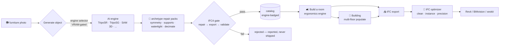
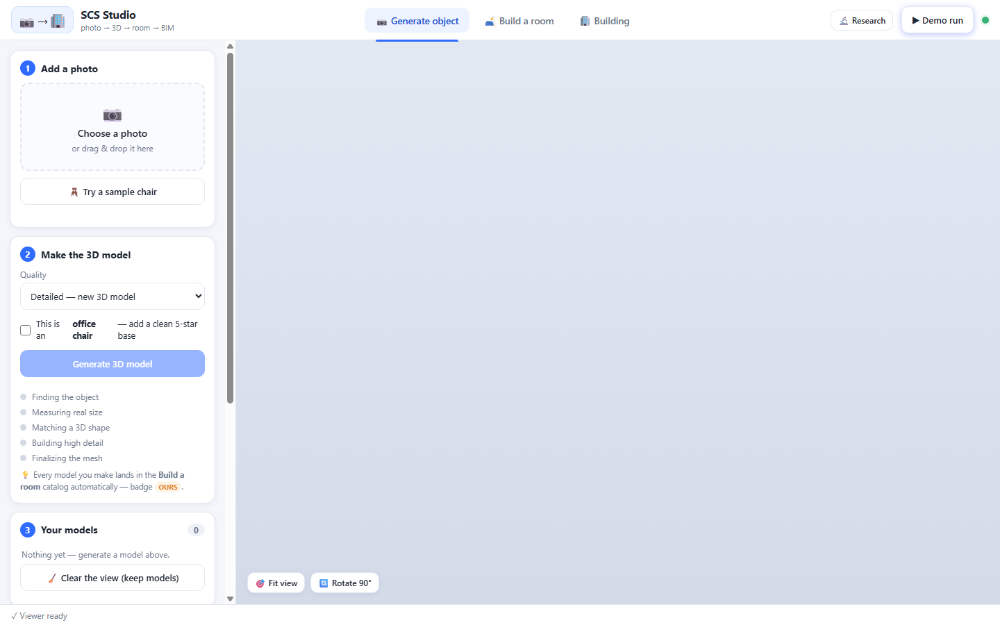
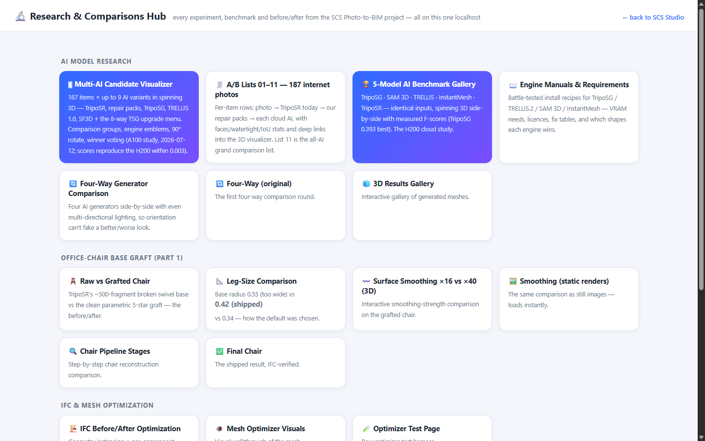
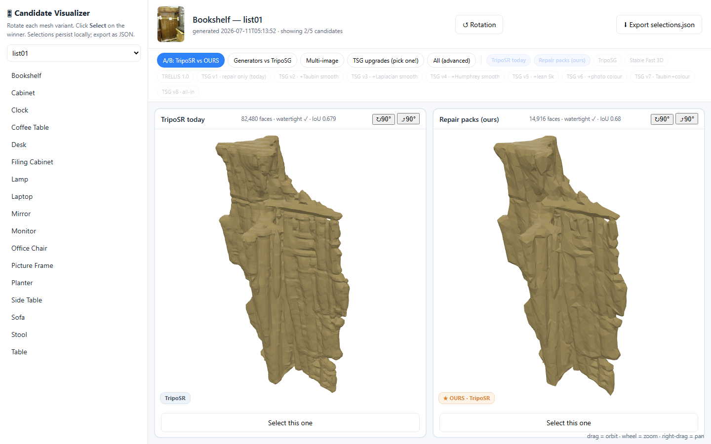
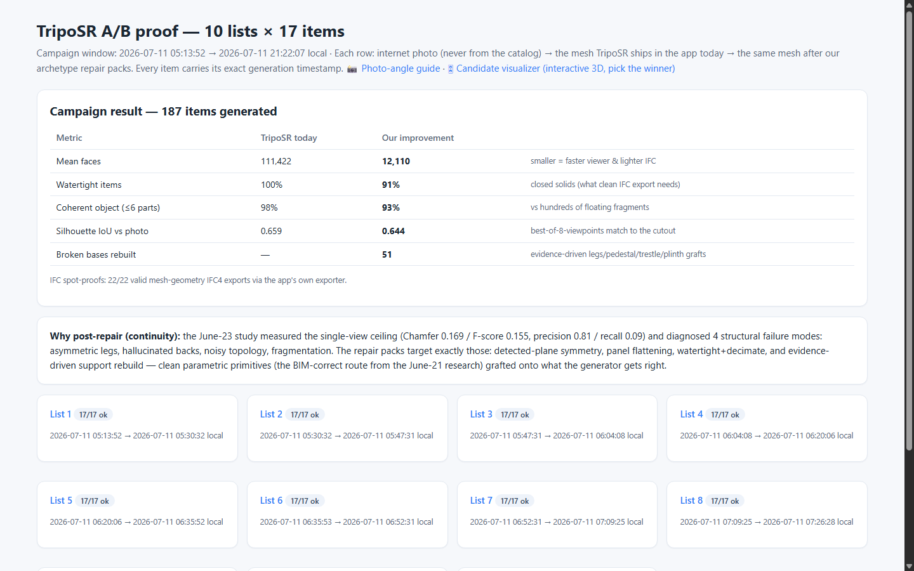
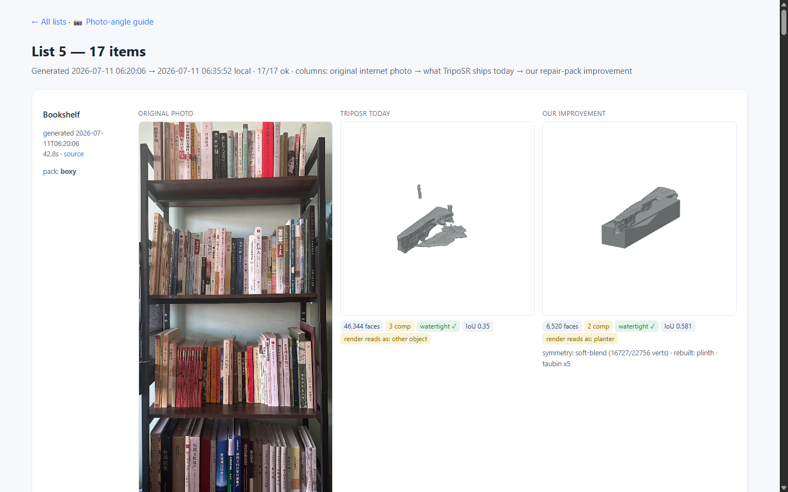
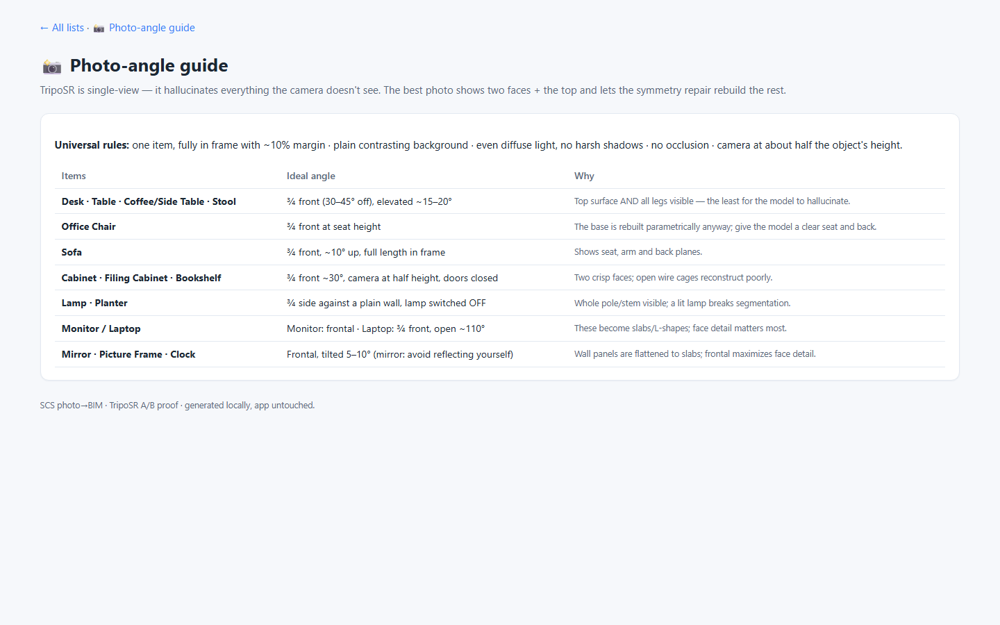
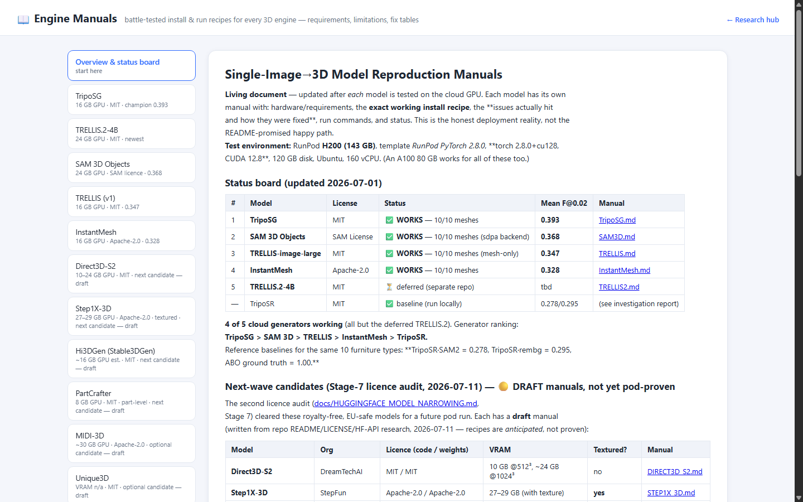
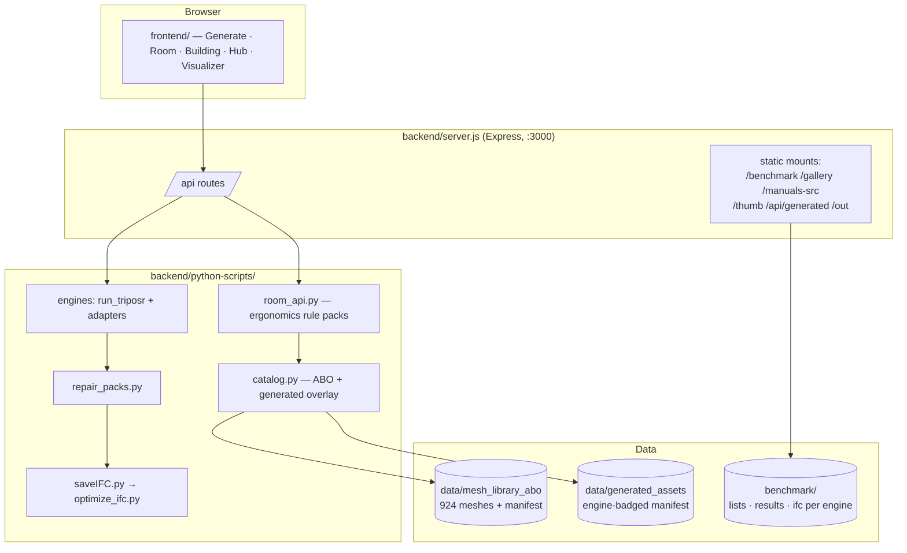

# SCS Studio — User Guide

**photo → 3D → room → BIM, in one app.** This guide walks every screen with real
screenshots, explains what happens behind each button, and doubles as the
functionality appendix for the project paper. Everything runs locally at
`http://localhost:3000` after `start.bat` / `npm start` — no cloud, no accounts.

---

## 1. The big picture

One sentence: **a photo becomes a repaired, validated, engine-badged 3D object
that populates rooms and buildings and exports as optimized IFC4 BIM.**

---

## 2. Generate object — the first tab

| Step | What you do | What happens underneath |
|---|---|---|
| **1 · Add a photo** | drag & drop, or *Try a sample chair* | photo stays on your machine |
| **2 · Make the 3D model** | pick Quality, optionally tick *"this is an office chair — add a clean 5-star base"* | the VRAM-gated engine runs; the category tick activates that category's **repair pack** (evidence-driven base rebuild, symmetry, watertighting, decimation to ~10–15k faces) |
| **3 · Your models** | preview, rotate 90°, delete ✕ | the mesh lands in the **Build-a-room catalog automatically**, badged <kbd>OURS</kbd> |

The progress list (*Finding the object → Measuring real size → Matching a 3D
shape → Building high detail → Finalizing*) mirrors the real pipeline stages.
Engines your machine can't run are simply not offered — that's the VRAM gate,
so a 6 GB laptop never freezes trying to load a 24 GB model.

---

## 3. Build a room — the ergonomics engine

Pick a room, choose furniture per category (the **⋯ pick** button opens the
catalog with previews), set counts, populate. The layout is not random — the
**rule packs** place every object like a human would:

- chairs get pull-out clearance behind desks; monitors and laptops face the sitter
- stools ring tables in a petal pattern; social tables sit centred
- clocks hang high on the wall opposite the seat; frames at eye level
- planters go beside mirrors/desks without blocking walkways
- a **capacity guard** refuses more furniture than the floor area can take, with an honest "not enough space" message — floor area is the only budget

The picker shows three source types side by side: **ABO catalog** items (924
CC-BY licensed meshes), **prim** parametric stand-ins, and **generated** items
badged by the AI that made them (<kbd>OURS</kbd>, <kbd>TSG</kbd>, <kbd>TRL</kbd>,
<kbd>SF3D</kbd>, <kbd>SAM3D</kbd>). Every generated item passed the repair → IFC4
validation gate before appearing here — nothing unverified is placeable.

**📥 Download all as one IFC** exports the room; the **IFC optimizer** runs
automatically (mesh cleaning cached per unique mesh, instancing so repeated
chairs are stored once, 0.1 mm coordinate rounding) and reports faces/size
reductions. **🧼 Clear & redo** resets a populated room without losing your picks.

---

## 4. Building — whole floors at once

Load a building shell (duplex sample included, or drop your own IFC), populate
every room, then navigate **per floor in 2D or 3D** — select a room to teleport
into it. The same ergonomics rules and capacity guard apply per room;
clash-audited placement keeps furniture out of walls even in non-rectangular
rooms. The populated building downloads as one optimized IFC.

---

## 5. Research hub — every comparison, one origin

The 🔬 **Research** button opens the hub: the whole project's evidence base now
rides inside the app (formerly separate localhost ports):

### 5a. Multi-AI Candidate Visualizer — `/benchmark/visualizer.html`

187 real internet photos × up to 9 AI variants each, spinning side by side:

- **Comparison-group tabs** (too many AIs for one window): *A/B TripoSR vs OURS ·
  Generators vs TripoSG · Multi-image · TSG upgrades · All*
- **Engine emblem** on every card (amber = ours) — you always know who made what
- **↻90° / ⤴90°** per card — fix a wrong-facing mesh exactly like in the app
- **Select this one** = your vote; **Export selections.json** downloads all your
  picks (the human-evaluation dataset for the paper, and the input for
  per-category engine routing)
- Chips dim when the current item lacks that variant; clicking a dimmed chip
  jumps to an item that has it
- Deep links: `visualizer.html#list05/desk` opens that exact item

### 5b. A/B lists 01–11 — `/benchmark/index.html`

Each row: **photo → TripoSR today → our repair packs → TripoSG → TRELLIS 1.0 →
SF3D**, with faces/watertight/IoU stats per variant and a *spin in 3D* deep link.
List 11 is the all-AI grand-comparison list (17 fresh photos, never used before).

### 5c. Photo-angle guide — `/benchmark/angles.html`

Which single camera angle gives each furniture type its best reconstruction —
practical shooting advice derived from the benchmark.

### 5d. Engine manuals — `/manuals.html`

Battle-tested install recipes for all 12 engines: VRAM requirements, verbatim
licences, and the fix tables earned on real GPUs (torch/CUDA matrices, ABI
traps, attention-backend whitelists, dependency pins).

---

## 6. The badges — provenance at a glance

| Badge | Meaning |
|---|---|
| <kbd>OURS</kbd> | generated in this app by you (TripoSR + repair packs) |
| <kbd>TSG</kbd> / <kbd>TRL</kbd> / <kbd>SF3D</kbd> / <kbd>SAM3D</kbd> | benchmark-campaign mesh by that engine, IFC4-gated |
| ABO | real catalog product (CC-BY-4.0, attribution in manifest) |
| prim | parametric stand-in |

---

## 7. Architecture (for the paper)

Design rules the architecture enforces: **one origin** (everything served by the
one Node app — research pages included), **catalog integrity** (only the
repair→IFC4 gate writes generated items), **provenance always visible** (badges
from manifest `engine` fields), **hardware honesty** (VRAM gating before an
engine is offered).

---

## 8. Troubleshooting

| Symptom | Cause / fix |
|---|---|
| An engine is missing from the Quality selector | your GPU doesn't meet its VRAM floor — the gate hid it deliberately |
| Generated mesh faces backwards | ↻ Rotate 90° in the preview (same fix exists on every visualizer card) |
| Mirror photos produce nothing | known limit: background removal can't find a foreground on mirror shots (documented benchmark finding) |
| A variant chip in the visualizer looks dim | that processing variant wasn't generated for the current item — click it to jump to one that has it |
| Room refuses more furniture | the capacity guard — the floor area is genuinely full |

---

*Cross-references: [PAPER_DELIVERABLES_INDEX.md](PAPER_DELIVERABLES_INDEX.md) ·
[COMPARATIVE_ANALYSIS.md](COMPARATIVE_ANALYSIS.md) (Studies A–E) ·
[SECURITY_COMPLIANCE.md](SECURITY_COMPLIANCE.md) ·
[HUGGINGFACE_MODEL_NARROWING.md](HUGGINGFACE_MODEL_NARROWING.md). This guide is
the paper's system-functionality appendix; the Mermaid diagrams render natively
on GitHub.*
