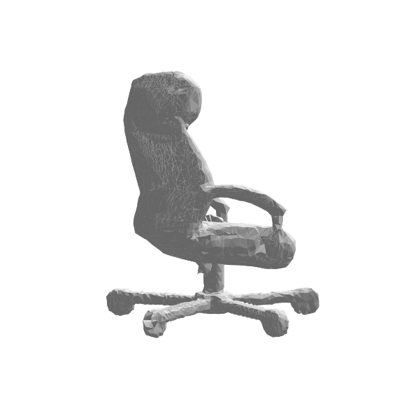
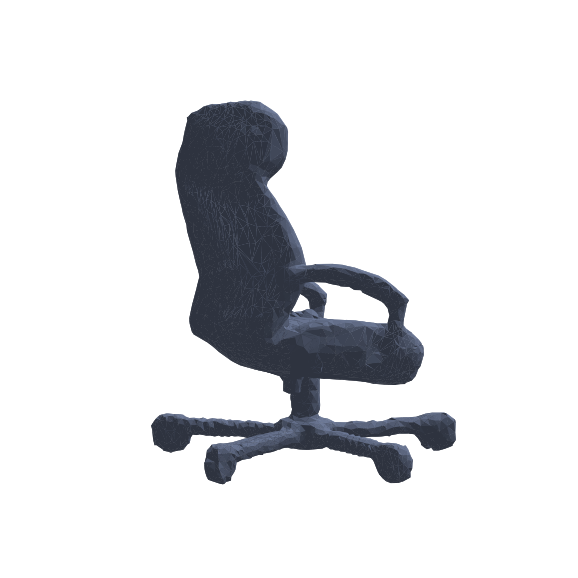
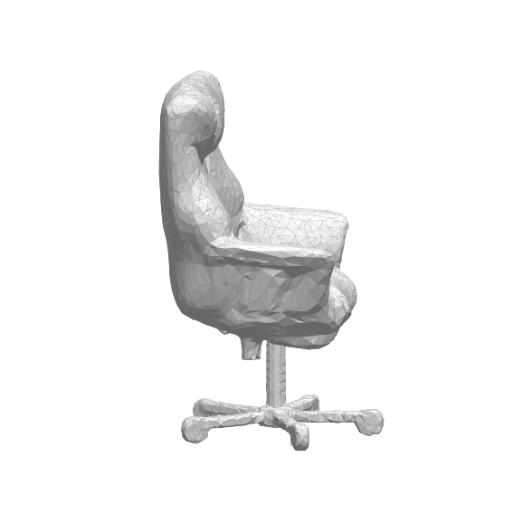
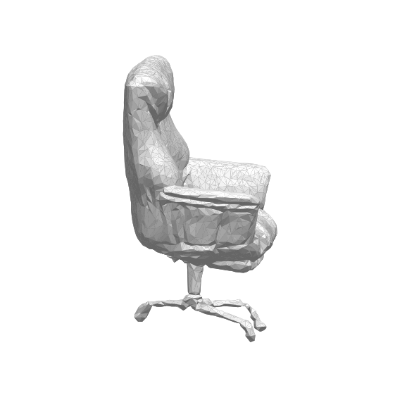
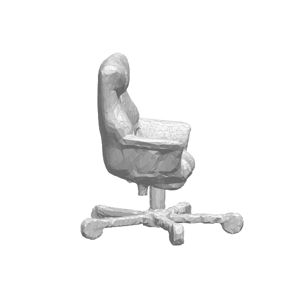

# Office-Chair Base Graft

Give AI-generated office chairs a **clean, correct 5-star wheelbase** that TripoSR cannot
reconstruct from a single photo — and carry it all the way into a **single-item IFC**.

Branch: `redesign-generator-ui`

---

## 1. The problem

TripoSR (our only locally-runnable image→3D model) reconstructs a chair's **seat, back and arms
well**, but the **rolling 5-star swivel base** comes out as ~500 tiny floating/fragmented pieces —
it has no information about the half-hidden, geometrically complex base from one photo. No amount of
mesh cleanup can rebuild geometry that was never generated (rotational-symmetry and mirror repair
were both tried in earlier work and reverted as failures).

**Ceiling:** the generator, not the post-processing. So instead of *repairing* the base, we
**replace** it: keep the good generated seat/back, cut the broken base off, and **graft a clean CAD
5-star base** underneath.

---

## 2. The result

| Generated office chair (in IFC) | Verified from the exported `.ifc` file |
|---|---|
|  |  |

Seat, back, headrest, armrests, gas column, and a clean 5-star base with 5 casters — colour
preserved — exported as **one `IfcFurniture` element** carrying the full merged geometry.

---

## 3. How the graft works — `backend/python-scripts/graft_chair_base.py`

1. **Clean** the raw generation (`clean_mesh`): debris removal → per-component watertight repair →
   Taubin smoothing → decimation to ~15k faces.
2. **Detect the up-axis** (tallest extent) and **cut off the bottom 20 %** (the broken base region),
   keeping the seat/back/arms.
3. **Smooth** the kept seat/back surface (Taubin, `SCS_CHAIR_SMOOTH`, default 16).
4. **Build a parametric 5-star base** in local Z-up: hub + gas column + 5 spokes + 5 casters, radius
   `SCS_BASE_RADIUS_FRAC × seat footprint` (default **0.42** — sits within the seat).
5. **Fuse the base into ONE watertight solid** (voxel remesh) so the debris filter and IFC optimizer
   keep it as a single component (individual casters would otherwise be dropped), then decimate/slim.
6. **Position** the base under the seat, at the chair floor; **merge** with the chair; re-apply the
   PBR base colour.

The output stays in **TripoSR's native frame** (no reorientation) — the app viewer already displays
that upright.

---

## 4. The full pipeline (every algorithm)

| Stage | File | Algorithms |
|---|---|---|
| **Generate** | `run_triposr.py` | TripoSR (transformer → triplane field → marching cubes); CLIP label; metric-scale from depth |
| **Mesh cleanup** | `clean_and_optimize.py` | connected-component debris filter (0.6 %); **pymeshfix per-component** (watertight repair, preserves multi-part objects); Taubin smoothing; Garland-Heckbert quadric decimation |
| **Base graft** | `graft_chair_base.py` | up-axis detect; base cut; seat/back smoothing; parametric 5-star base; voxel-solidify + refit + decimate; colour capture/apply |
| **IFC export + optimize** | `optimize_ifc.py` | GLB → `IfcTriangulatedFaceSet`; decimation; **geometry instancing** (hash-dedupe identical meshes); coordinate precision rounding; IFC-zip |

---

## 5. How to use

- In the app (**localhost:3000**): tick **“This is an office chair — add a clean 5-star base”**
  (TripoSR engine only), then Generate. Because CLIP frequently mislabels swivel chairs, the toggle
  is the trigger — and ticking it also corrects the IFC label to **Chair / IfcFurniture**.
- **Download all as one IFC** → single-item IFC with the base, auto-optimized.

**Env switches** (all optional):

| Variable | Default | Effect |
|---|---|---|
| `SCS_GRAFT_CHAIR_BASE` | `1` | `0`/`off` disables the graft; `allchairs` widens beyond office chairs |
| `SCS_BASE_RADIUS_FRAC` | `0.42` | base spoke length ÷ seat footprint (0.55 = old wide base, 0.34 = stubby) |
| `SCS_CHAIR_SMOOTH` | `16` | Taubin smoothing passes on the seat/back |

---

## 6. Tests & comparison pages

Live pages (depend on regenerable files under `outputs/`):

- `frontend/graft_compare.html` — before/after graft
- `frontend/legs_compare.html` — base leg-size comparison (below)
- `frontend/smooth_compare.html` (3D) / `frontend/smooth_static.html` (images) — smoothing comparison

### Base leg size — chose **0.42** (base ≈ seat width)

| Current 0.55 — **1.20× seat (too wide)** | Proposed 0.42 — **0.92× seat ✓** | 0.34 — 0.74× (stubby) |
|---|---|---|
|  |  |  |

### Surface smoothing — kept ×16 (×40 is a marginal, safe option)

| Original raw TripoSR | ×16 (current) | ×40 (proposed, subtle) |
|---|---|---|
|  |  |  |

Big jump is raw → graft; ×16 → ×40 is small because 15k faces (not smoothing) is the limit.

---

## 7. Verification (end-to-end, from the exported IFC)

- **1** `IfcFurniture "Office Chair"` element — one singular item (required for building population).
- Geometry = seat/back (~11–14k faces) **+ 5-star base (~3.5k faces)**, base below the seat.
- Base **survives the IFC optimizer** (per-component pymeshfix fix).
- Robust across multiple independent app-generated chairs (upright, base preserved).

---

## 8. Bugs found & fixed during this work

| Bug | Cause | Fix |
|---|---|---|
| Base exploded ~170× | `VoxelGrid.marching_cubes` returns voxel-index coords | refit solid to its true AABB |
| IFC dropped the base | pymeshfix collapsed multi-part mesh to largest piece | repair per-component, recombine |
| Chair shown sideways | seat-leveling + X-up canonicalize reoriented the mesh; stacked with the viewer's fixed rotation | **removed** both — keep native frame |
| Legs too wide | base radius `0.55 × seat` | default → `0.42 × seat` |

---

## 9. Known limitations (honest)

- The base is a **clean generic** 5-star base, **not a pixel-match** of the photo's base — TripoSR
  can't rebuild that; we substitute a correct standard one.
- **Recliners / footrests** in the photo are generated as a standard office chair (footrest dropped)
  — a generation limitation, not the graft.
- **Surface** stays somewhat soft/faceted — inherent to TripoSR at a 15k-face budget. The real levers
  are a stronger model (TripoSG/TRELLIS/SAM3D, needs more VRAM) or the catalog/retrieval path.
- **Seat recline** correction was removed (it broke orientation); the seat keeps TripoSR's natural
  recline. Revisit only with a method verified in the actual app viewer.
